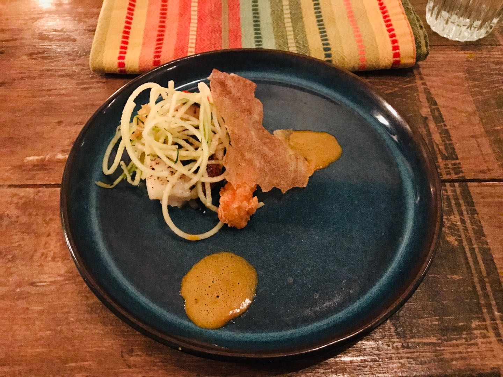

[`返回`](README.md)

> 标题：2018.12冰岛一周自驾环岛游记  
> 创建日期：2018-12-30   
> 修改日期：2019-01-07      
> 摘要：冰岛一周游记，流水账系列。

# 引言
冰岛一直是我想去的国家，由于我在德国，趁着12月圣诞假和朋友们来一次自驾环岛，共两个男生两个女生。全程预计2500km，讲真之前还没开过这么长的距离，心里还是有点发虚的.而且本来预计是三个司机，然而另一个司机出了点状况来不了了，最后只剩两个司机。不过最后我们还是完美地跑了下来，还是很令人自豪的。冰岛真是个自然景观达到了极致的国家，在其他地方看不到这样的美景，真的令人陶醉。一周的旅行让我完全置身于烦恼之外，导致回来之后感到无比的空虚。。躺床上闭上眼睛，仿佛下一次睁开眼睛又会是在冰岛的小木屋中，即将开始下一段旅程。可惜睁开眼只有现实。趁着记忆还新鲜，赶紧记录下来，不然之后留给我的就只有那一段很不真实的记忆了。

# 行前准备
机票、住宿定好，大致的行程定好，驾照在国内公证好寄来德国，在Metzingen打折村入了北脸的防风裤和手套，以及Timberland的大黄靴子，毕竟是冰岛，还是要做好保暖措施的。（后面发现，冰岛其实并不冷，温度不低，只是经常风大。）其他的就没啥，等着被冰岛的自然景观震撼吧。

# Day1 12.21 抵达
早上从巴登巴登机场出发，经柏林转机，经历了一小时的晚点，最终于下午5点抵达冰岛。正好座位是靠窗的，从飞机上往下望去，冰岛已经是经验到我了，伴着夕阳，雪山和冻原交替着，加上对未来一周的冰岛之行的满心期待之情，那种感觉无法形容，总之就是个激动。

  
（柏林飞往冰岛）  
  
（飞机上的夕阳）  
  
（飞机上俯瞰冰岛）  

同行的两个妹子，燕和蓉，已经在一小时前抵达冰岛了，另一个司机，博，半夜12点才到。。于是我们先去机场附近的Sixt租车公司取了车，一辆Ssangyong Tivoli SUV，最便宜的四驱车。。取车的时候还发生了点小插曲，并不知道怎么发动汽车，开暖气和开后备箱哈哈。问他们，感觉我们像傻子一样。。并且一出停车场，在大雾的情况下没仔细看后边的车流情况，就直接进道了，结果碰到一辆警车，就被拦下来了，被教育了一番放走了。。真的能行吗这样！感觉很慌！

  
（即将陪伴我们一周的爱车）  
  
（黑夜里的大雾）  

先去了宾馆把东西放下，立马品尝了下冰岛的自来水，简直美味！真的感觉非常清凉，非常舒服！真的是我喝过最好和的自来水，没有之一！然后晚上三个人一起去了雷克雅未克市区找点乐子。开过去将近一小时，算是适应适应。黑夜里的雷市真是漂亮！点点灯光灿烂无比。在市区逛了一圈，找了一家快餐吃了晚餐，一个大面包掏空，中间加入各种汤，重点是汤还能免费续！只需要2000克朗，性价比简直超值了！（因为是和后面几天的行程比起来，真的是便宜至极。。）海鲜汤真的是美味，店里放的各种甜品也随便吃，后面人越来越多，简直网红店。我后面续了一碗鳕鱼，也是相当不错的，还有羊肉汤，可惜我的胃不允许了。

  
（海鲜汤面包快餐）

饱餐一顿之后去了趟超市，买了之后的食物就回去了。话说这里的物价真的是逆天了啊，一小瓶矿泉水6欧，惊为天人。大半夜去机场接了博之后，回去唠唠嗑就洗洗睡了。酒店还有打乒乓球的地方，可惜玩不动了。（后面发现还有台球！）明天正式开始冰岛之旅！

# Day2 12.22 雷市+温泉
今日行程：在雷克雅未克市逛逛，转完之后晚上去蓝湖温泉泡温泉。  
一大早赶了个大早，出发去雷克雅未克市。（其实只是天没亮而已，然而冰岛11点左右天才亮。。）去了家网红早餐店Bakari Sandholt，打算品尝品尝冰岛的网红早餐。然而我们傻逼了，并没有点餐，而是点了店里的快餐，以为他们就是卖这些。。等我们在店里啃着面包的时候，看到边上人吃的却是热乎乎的早餐，感觉特别的蠢。。无奈最后点了两份甜品品尝了下，还是很美味的。

  
（早餐三明治）  
  
（早餐甜品）  
  
（玩弄可怜的甜品）  

吃完早餐天刚蒙蒙亮，去海边走了走，日出惊艳到我了，真的是属于随手一拍就是壁纸系列。在海滩边无聊的几个人用石头搭了个小塔，留下我们的痕迹哈哈。冰岛的一切对我们来说都是新鲜的，甚至是一个对他们来说普普通通的垃圾桶，我们都围着拍照了好久。路过了市政厅和音乐厅，逛了下哈尔格林姆斯大教堂，路过了阴茎博物馆（太贵没进去哈哈，而且两个妹子好像比较尴尬），最后去了珍珠楼，算是把雷市都逛了一圈。晚上在市区的Ostabuoin Veitingahus吃了顿晚餐，海鲜汤和一盘叫不出名字的菜。没有太多印象，海鲜汤还是比较不错的，毕竟冰岛特产。

  
（雷克雅未克的海边）  
  
（我们的石塔）  
  
（美丽的鸭子）  
  
（萌萌的垃圾桶）  
  
（雷克雅未克一角）  
  
（宏伟的大教堂1）  
  
（宏伟的大教堂2）  
  
（宏伟的大教堂3）  
  
（宏伟的大教堂4）  
  
（阴茎博物馆的迎宾石）  
  
（珍珠楼顶上看落日）  

逛完了雷市之后，去了今晚的民宿，惊闻此处有斯诺克球桌，而且还是史蒂夫·戴维斯打过的地方！哇激动了激动了！不过还得去泡个温泉，回来再玩，和民宿老板约了下之后给我开放球桌。说说蓝湖温泉，一个人85欧，近几年涨价很厉害，貌似三四年前才40+，大概是为了控制人数吧。但进去之后人还真的不少。换好衣服冲了一下身子，然后就径直暴露在了0度以下的空气中，看到温泉就直接冲了进去什么也不管了，外面实在太冷了好吗。。进入温泉之后，那强烈的反差，简直要高潮了，太舒服了吧！温泉一股硫磺味，习惯了之后感觉就还好。火山泥敷脸之后，拿了杯果汁，和朋友们侃大山，其乐无穷。期间还有个小插曲，最后打算去储物柜拿手机拍照留念的时候，发现放手机的裤子不在柜子里，突然害怕，怕不是没放进去？结果还真是，在一旁的椅子上躺着呢。十分庆幸居然还在。。在国内早没了好吗。

  
（夜里的蓝湖温泉）  

回到了民宿，得马克一下这家民宿，博加斯旅馆，也是在机场附近。四个人住一间房。楼下有台球室，黑八随便玩，但是斯诺克需要和房主通告一下的，并不是所有人都能玩的，需要了解斯诺克的人才能碰。世锦赛级别的桌子，球杆，和球，这里曾经是众大佬聚集地，亨德利，马克威廉姆斯，希金斯等等（吐槽，没有火老师！），民宿的老板曾经是一家俱乐部的老板，12岁开始打球，所以和他们都很熟。在老板的注视下，我感觉打球异常有压力，而且好久没碰球杆了，真的是打都打不准了，还被老板教了一番如何瞄准。。不过这老板一看就是高手，可惜他要走了，没法陪我玩。练了一会之后就感觉手感上来了，真的是指哪打哪，太爽了吧！敢情我之前打不好不是我的错，是设备不够好哇！后来和老板娘攀谈了一会，她拿出了一本很旧的相簿，可惜里面的大佬我基本不认识，都是上个世纪的大佬了哇！这里的球台我都不舍得打，净是在拍各种艺术照了。。感觉已经值了，此趟冰岛之行。

  
（世锦赛级别的斯诺克球桌）  

# Day3 12.23 辛格韦德利国家公园+间歇泉+黄金瀑布+圣诞大餐
第二天将近12点抵达了辛格韦德利国家公园，天正好刚蒙蒙亮。这个国家公园还是非常大的，之前世界上最早的议会在此召开。毕竟作为黄金圈的一大顶梁柱，还是很有牌面的。走了一圈，围观了一个小瀑布，接着就发车前往间歇泉。

  
（国家公园一角）  
  
（国家公园瀑布）  

间歇泉地面上好多个小洞洞，不断往上冒着热气。两个姊妹泉眼相距不远，5分钟走路距离，妹妹给的面子够足，我们足足看看三回喷发，姐姐却是比较高冷，一回都没看到。看到那一个个的大洞，就想着往里钻，钻到最深处去瞧瞧是什么样。

  
（间歇泉）  

离开了间歇泉之后差不多已经天快黑了，一天毕竟只有4小时的日照时间。。赶紧驱车前往黄金瀑布，希望能够在天完全黑之前参观到。最终成功看到这一壮观的自然风光，和之前在国家公园看到的小家碧玉的瀑布完全不是一个数量级的，留给我们的只有震撼。图还是照样放出来，但是完全表达不出来当时的感受，那种扑面而来的气息。

  
（黄金瀑布1）  
  
（黄金瀑布2）  

晚上在Selfoss找了家评分很高的餐馆，价格也是高的吓人，圣诞套餐一人12000克朗。。然而秉着“来都来了”的旅行哲学，一人点了一份圣诞套餐，就等着享受吧。最后这份大餐真的没让我们失望，感觉值得这个价。总共七道菜，每道菜都细细打磨，细细配合。如果把各种食材单独拎出来，其实并不见得有多好吃，但是经由他们一搭配，感觉就不一样了。说不出啥味道，因为之前从来没吃过这种食物。大部分是海鲜，而且七道菜分量十足。中间我们还暂停了一会，因为实在吃不下了，去超市买了点东西回来继续。。

  
（圣诞大餐菜单）  
  
  
  
  
  
  
（圣诞大餐）  

吃完圣诞大餐已经是晚上十点多了，然而距离我们今晚住的民宿还有很长一段的距离。于是就开始我们的飙车之路了哈哈！今晚我驾车，后座俩妹子给我们放周杰伦的《漂移》，这谁顶得住啊！速度噌噌噌就上来了，大晚上飙到150迈，也是没谁了。和另外三个路人互相飙车超车，巨爽，你超我我超你，达到了高度的默契，如此高的速度超车我感觉我的肾上腺素也飙到了顶点了。最后我们四辆在进市区的时候全员超速。。也不知道有没拍照罚款。。

此时已经十一点多了，然而和民宿老板约的是11点入住。路遇一个景点，又一个瀑布，于是就拐了进去瞧了瞧。大晚上的已经没人来看瀑布了，借着景点的聚光灯，还是能感受到瀑布的壮观的。尤其是边上有个小道可以爬到半山腰，愈发近距离地感受瀑布。上去的时候迎面扑来的水汽，在这里是只属于我们四个人的壮美，可以说是另外一种震撼，一种超近距离的震撼。

  
（夜观瀑布）  

抵达民宿之后，老板娘接待了我们，给了我们十分错误的信息。。说10 meter就能右转，然后就到了，结果我们真的10米就转，却是老板娘的房子哈哈。后来才知道，要到很前面再转，而且得很深入。这又1公里了吧啊喂！中间我们还找错了房子，一个破烂不堪的仓库和一栋有狗的房子。最后终于找到了我们的房子，却发现后车窗关不上了。一波未平一波又起啊！我们都已经做好了明天等待救援队的到来，然后明天行程泡汤的打算了。后来还是同行博，学汽车的大佬，想起了他之前学过的关于自动车门的知识，解决了问题。。不然真的只能呆在原地了。这番折腾到了两点多。民宿的房子还是很温馨的，很有感觉。两个房间一客厅，我选择睡客厅，特别有守夜人的感觉哈哈。

# Day4 12.24 飞机残骸+海蚀拱+维克黑沙滩
早上十一点多抵达飞机残骸附近，需要徒步3.6公里到达残骸。那就走呗，来都来了。这里其实也属于黑沙滩的范围，1973年一架美军飞机因燃料不足迫降冰岛南部，机组全部生还。因为回收成本过高，移走主要仪器之后残骸就一直留在了这。看到一大堆人爬到飞机顶部，其实是有点不爽的，仿佛听到了残骸的哭泣声。然而也不能做些什么。我是不愿意合照的，选好角度在没人的时候给残骸来了几张艺术照。过了残骸之后再往前走，就是海岸线了。

  
（飞机残骸）  

下一站，海蚀拱。经过了几段惊心动魄的陡峭山路之后，准备徒步前行。前方就更加的惊心动魄了。。这里大概有12级台风了吧？需要几个人互相扶持着才能前行。尤其是一个悬崖边上的电线杆边上，两个大男人在这里感受到了大自然的力量，巨大的风从下而上，阻挡着你继续前行。这里感觉是风最大的地方了，只不过是自下而上的风，所以人还能站得住。

  
（海蚀拱）  

之后一个灯塔让我眼前一亮，毫不犹豫掏出手机拍了个照。但是照片中的灯塔却是如此的静谧，很难想象在这么一个地方，狂风呼啸。继续往前走，海蚀拱便出现在了眼前，震撼之感难以描述。反正就是，从来没有见过这样一个大石头！矗立在大海之中，扑面而来的压迫感。照片看看就好，静态的东西是体现不出如此动态的景色的。

  
（海蚀拱灯塔）  

这里有个小插曲，在过了海蚀拱之后还有个小景点，标注在谷歌地图上。我们驱车前往，抵达之后面前就是一个公共卫生间。于是乎，我们一起先进去方便了之后，两个妹子就回到了车上。我们以为她们进车里拿东西之后再出来，所以我们就在外面等。然而等半天也不见她们出来。我们中间还问了她们，准备好了吗？（去真正的景点）她们还回答，准备好了！最后我们进车里头一看，她们居然都系上了安全带！她们还反问我们，为啥我们一直在车外不进来？敢情你们是准备好了跑路了哇！我们是准备好了去景点！于是乎，“景点”成为了我们之后卫生间的代名词。

下一站，黑沙滩。一进入黑沙滩就是一大堆的警告牌，禁止我们太靠近岸边，以防被浪卷走。满眼黑色的沙滩，以及长条状的岩石，最后我们各带走一块黑色的小石头。嗯，这里是个很危险的地方，曾经有游客由于太靠近岸边而被卷入大海，真的可怕。而且我们亲眼目睹了岸上的游客被浪花拍倒在沙滩上，全身湿透，寸步难行。但是！冒险是我们的精神，本着“来都来了”的哲学思想，我们两个男生决定和大海玩场游戏。在浪花的左侧，有着隐藏的“秘密房间”，但是需要找准时机，在浪花还没冲上来的时候冲过去。如果浪过大，就有可能湿身的危险。就这样，冲鸭！我们穿过两个关卡，来到了隐藏房间的最深处——神似电影拍摄地的场景。而且，我们还看到了一位摄影大兄弟的相机被活生生卷入海中。不过还是很佩服他的淡定哈哈！纵使相机掉了，衣服湿了，也不妨碍我继续用手机拍摄！至此，我们通关了50%的游戏。剩下50%自然也是有惊无险。有意思有意思。

  
（黑沙滩石柱）  
  
（黑沙滩隐藏房间）  

晚上回到民宿，简单晚餐过后，和博探讨了一晚上的人生，深感人生压力之大，但又无可奈何。我们都不希望自己最后成为机器人，但是也完全不知道十年，二十年之后的我们会变成什么样。深夜，我独自一人喝着冰岛的“啤酒”（其实是维京饮料，一种不含酒精的类酒精饮料，非常的甜，也有泡泡）。旅行已过半，时间过的真快呀！

  
（朴实的晚餐）  
  
（维京饮料）  

# Day5 12.25 蓝冰洞徒步+钻石沙滩+霍芬自助餐+独自追光
今天由于蓝冰洞徒步定的比较晚，只有9点多的第一批了，本来预计是12点多，所以原计划早上有个另外一个徒步，只能放弃。所以今天的行程其实比较松。早上九点多抵达钻石滩，但是此时天都还没亮啊喂！感觉只是来到了山沟沟里。和今天的导游及其他同行者汇合之后，坐上大脚车出发。大脚车的脚是真的大，整个车都超级大，头一回坐这种车。。徒步还需要我们配有钉子鞋套以及带探照灯的头盔。经过在满是坑的冰路上的颠簸之后抵达第一个山洞，名为“蛇洞”，因为洞的入口处真的很像蛇皮，是由于之前水的漩涡不断冲蚀着石头导致的。里面错综复杂，神似迷宫。这个洞是黑漆漆的，因为冰不够厚，而且里面布满了火山灰，所以看起来就是黑不溜秋的。

  
（大脚车）  
  
（蛇洞）  

再一次颠簸之后抵达第二个洞。这个洞就漂亮多了，四处都是蓝蓝的冰，因为这里的冰层足够厚，再经过阳光的作用，也就呈现出了湛蓝色，晶莹剔透的冰。当然这个洞也不是很大，跟前一个完全没法比，有种小家碧玉的感觉。

  
（蓝冰）  

中午十二点，我们今天的行程已经结束了。今天是圣诞，所以大部分的参观都不开。我们抵达霍芬，一个小镇，查到了一家自助餐今天还是开着的，但是下午三点才开门。于是我们在小镇逛了一逛，还偷上人家的渔船感受了一下。。真是皮的不行。

  
（偷上渔船）  

下午三点，我们花了三个小时吃足了今天的大餐。虽然贵，但是自助餐真的很良心，各种顶级牛羊猪烤鸡肉不说，三文鱼什么的也是家常便饭，还有龙虾汤，各种顶级甜点，光是提拉米苏就足够我回味一阵子了。同行的博饭量大，帮我们其他人都吃回了本。他让我们每次去拿新东西的时候都帮他带些，他怕他一直去拿的话会被嫌弃哈哈。最后满载而归，开了三个半小时的山路，最后我下车的时候腰都直不起来了。。头一回连续开这么久的车，感觉车技进步神速。

  
（维克自助餐）  

抵达民宿之后，他们基本都洗洗去睡了。但是今天天气好哇，赶紧追上民宿老板问了问附近蹲极光的点，听说小镇的北部有个公园，地势高，光污染小，于是晚上十点独自出门追光。一路向北，夜晚的雪山又一次把我惊艳到了，在月光的照射下，雪山群是那么近那么近，惊艳到我是全程张大嘴巴的。。车停在停车场，继续徒步向北爬了有半个小时，最后发现不太对劲啊，这里并没有路啊，只是很小很小的有人踩过的痕迹，一路上需要披荆斩棘。于是下山，在半山腰逛了一逛。星空非常美，夜里的月光非常亮，很棒的体验。一个大坝一样的东西也是雄伟的很，沿着堤坝来回走。只可惜到最后也没看到极光，只是漫天的星空和月亮。最后开车去往小镇的东西两侧的尽头，也是无果。不过路上倒是看到了一个墓地，所有的墓碑上都挂着彩灯庆祝圣诞，看着怪吓人的。。

  
（独自追光俯瞰小镇）  

# Day6 12.26 各种瀑布+组团追光
经过之前几天神级美景的冲击之后，现在的我们已经是有点审美疲劳了。而且，由于是一周环岛，且前几天的景点都比较集中，所以后面这几天基本也都在赶路了，路上遇到什么景点就走马观花看看。今早，从一条长8km的隧道出来之后，瞬间就被眼前的朝阳惊艳到了，这是一处完全不会标在谷歌地图上的美景。遂停车欣赏，这日月同辉的盛景。

  
（绝美朝阳）  

之后小爬了一座小山，看了些瀑布，但是感觉也都差不多。同行的燕在爬山的过程中由于路面结冰太滑摔了一跤，看的心惊肉跳，因为边上就是很高很高的悬崖，如果摔下去后果不堪设想。她本身也是蹦蹦跳跳的，看的让人揪心。还好最后只是摔在冰面上，并无大碍。后来下山的时候，平地上，我也来了个平地摔。。

  
（“摔”看瀑布）  

其余的就只是赶路赶路赶路。看完了诸多美景之后，剩下的只是一个心愿了——看到极光。于是乎今晚组团出发去追光。今晚其实是住在米湖边上的，米湖本来也是我们的一个景点，然而行程安排不当，并不能看到米湖的景色。。而且附近很多景色白天来不及看，只能趁着夜色去感受一下，一个是火山口，黑漆漆的只能感受到从火山口喷出的巨风，对，很大很大的风。。去火山口的路上还会经过一个工厂，估计是地热发电厂，因为到处散发着硫化氢的臭味。。还有一个是“K5”，哈哈是博的英文发音东北味儿，于是被我们吐槽了，其实是cave，一个山洞。我们在黑夜里拿着手电筒找洞口找了半天，因为一路上有很大很长的裂缝，所以走路也是小心翼翼。最后找到洞口了，由于太黑，只能稍微在洞口处往里张望了下。但是这次是我们自己的探险，我永远会记住这一段美好的时光。之后便开车前往深山老林，然后开始蹲极光。各种唠嗑，然后平板放歌，最后我和燕在车外冷风中聊着人生。据她所说看到了流星，然而我啥也没看到。。再后来博也加入我们的聊天队伍，剩下蓉一个人在车里睡觉。今晚其实极光指数不高，而且天空中多有云。果不其然，最后还是啥也没有，遗憾而归。不过今晚的民宿很温馨，博住阁楼，我住一间，另两个妹子一间，特别有家的感觉。

# Day7 12.27 阿克雷里
昨晚又“看了”两个景点之后，今天的行程也就轻松许多，白天主要是在阿克雷里，晚上赶路到冰岛西北部。朝阳依然是惊艳到了，这两天的朝阳都很美丽啊。看了个似乎还挺大的瀑布之后就出发前往阿克雷里了（对瀑布实在是无感了。。）。阿克雷里大教堂，神奇的博物馆，和另一个教堂。值得一提的是，在那个神奇的博物馆中，有一个可以供游客自己玩耍的画室。燕对着照片画了一张风景照，可以看得出来还是很有功底的。然后我们就开始互相画人像哈哈，其乐融融。之后的行程就比较的索然无味，基本都是走到哪看一下，继续走。而且今晚的极光概率很低，放弃。今日民宿是两间房，而且都有厨房。今晚就几个人聚在一间简单吃着超市的微波食品，而后和博聊聊音乐。

  
（再一次惊艳的朝阳）  
  
（阿克雷里燕的画）  

# Day8 12.28 西部区收尾+迟到的烤鸡
今天是整个旅行的最后一天，主要在西部区逛，然后晚上赶回雷克雅未克市，并入住机场附近民宿。今日的行程也比较杂，让我印象比较深刻的也就只有小海蚀拱和那边巨大的浪拍打着悬崖的场景了。

  
（小海蚀拱）  
  
（小海蚀拱的浪）  
  
（小海蚀拱的灯塔）  

今日倒是补上了前两天没吃成的烤鸡，直接买了两头，上车了直接解决掉一头，真香！雷克雅未克市简单吃了个快餐，和头一天晚上差不多的快餐，就结束了。晚上本来还计划着能看个极光，因为今天极光指数很高，但是天气实在不允许，而且明天早上四点半要起床赶飞机，于是乎就只能作罢。（后来听说在东部看到了极光！摔！）我，博，和燕三个人聊着天，总结总结这次旅行，也就算是彻底结束了这次冰岛之旅。没看到极光还是有些小遗憾的。今晚的民宿可以说是最舒服的一家了，是一位老师的家里，一切都准备周到，各种咖啡糖果随便吃。可惜不能待太久就得离去。

  
（饱经沧桑的车屁股）  

# Day9 12.29 返程
早上六点的飞机，返回法国巴黎。感觉整趟冰岛之旅的精华在最后这里了。。因为四点半起的床，磨磨蹭蹭吃早餐，五点才出门。于是乎，拼命赶时间，把妹子们送到机场之后我们去还车，因为她们有个行李箱需要托运。我和博又跑了一路去机场，我又遇到邮箱打不开之前已经打开好的登机条形码，给急的。还好我们前往法国巴黎的飞机晚点，有惊无险我们赶上了飞机。但是那两个妹子，前往德国法兰克福的，却很遗憾地没赶上飞机，而且廉航wow air又没法退改签，只能重新买票。。真是“完美”的结局啊！

# 后记
刚回来的时候，感到真的特别的空虚，仿佛一睁眼又能回到冰岛这片美丽的土地。可惜现实终究还是要面对。花了过万字的流水账记录下这趟旅行，怕的是以后记性不好忘了细节，那就真是可悲了，就更感觉是一次假的旅行。游记记录完毕，是时候回归生活了。但是这一趟是真正属于我们的冰岛探险，我无论如何都不会忘记这次我们自己的探险！而且冰岛，我总有一天还会再来一次的，等我！

**（完）**

[`返回`](README.md)  