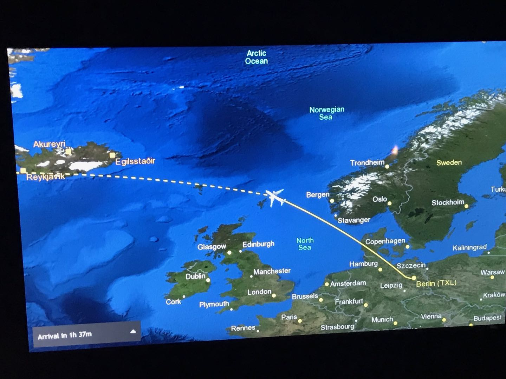

[`返回`](README.md)

> 标题：2018.12冰岛一周自驾环岛游记  
> 创建日期：2018-12-30   
> 修改日期：2018-12-30   
> 标签：旅行   
> 摘要：

# 引言
冰岛一直是我想去的国家，由于我在德国，趁着12月圣诞假和朋友们来一次自驾环岛，共两个男生两个女生。全程预计2500km，讲真之前还没开过这么长的距离，心里还是有点发虚的.而且本来预计是三个司机，然而另一个司机出了点状况来不了了，最后只剩两个司机。不过最后我们还是完美地跑了下来，还是很令人自豪的。冰岛真是个自然景观达到了极致的国家，在其他地方看不到这样的美景，真的令人陶醉。一周的旅行让我完全置身于烦恼之外，导致回来之后感到无比的空虚。。躺床上闭上眼睛，仿佛下一次睁开眼睛又会是在冰岛的小木屋中，即将开始下一段旅程。可惜睁开眼只有现实。趁着记忆还新鲜，赶紧记录下来，不然之后留给我的就只有那一段很不真实的记忆了。

# 行前准备
机票、住宿定好，大致的行程定好，驾照在国内公证好寄来德国，在Metzingen打折村入了北脸的防风裤和手套，以及Timberland的大黄靴子，毕竟是冰岛，还是要做好保暖措施的。（后面发现，冰岛其实并不冷，温度不低，只是经常风大。）其他的就没啥，等着被冰岛的自然景观震撼吧。

# Day1 12.21 抵达
早上从巴登巴登机场出发，经柏林转机，经历了一小时的晚点，最终于下午5点抵达冰岛。正好座位是靠窗的，从飞机上往下望去，冰岛已经是经验到我了，伴着夕阳，雪山和冻原交替着，加上对未来一周的冰岛之行的满心期待之情，那种感觉无法形容，总之就是个激动。

  
  
  

同行的两个妹子，燕和蓉，已经在一小时前抵达冰岛了，另一个司机，博，半夜12点才到。。于是我们先去机场附近的Sixt租车公司取了车，一辆Ssangyong Tivoli SUV，最便宜的四驱车。。取车的时候还发生了点小插曲，并不知道怎么发动汽车，开暖气和开后备箱哈哈。问他们，感觉我们像傻子一样。。并且一出停车场，在大雾的情况下没仔细看后边的车流情况，就直接进道了，结果碰到一辆警车，就被拦下来了，被教育了一番放走了。。真的能行吗这样！感觉很慌！

  
  

先去了宾馆把东西放下，然后晚上三个人一起去了雷克雅未克市区找点乐子。开过去将近一小时，算是适应适应。黑夜里的雷市真是漂亮！点点灯光灿烂无比。在市区逛了一圈，找了一家快餐吃了晚餐，一个大面包掏空，中间加入各种汤，重点是汤还能免费续！只需要2000克朗，性价比简直超值了！（因为是和后面几天的行程比起来，真的是便宜至极。。）海鲜汤真的是美味，店里放的各种甜品也随便吃，后面人越来越多，简直网红店。我后面续了一碗三文鱼，也是相当不错的，还有羊肉汤，可惜我的胃不允许了。

  

饱餐一顿之后去了趟超市，买了之后的食物就回去了。大半夜去机场接了博之后，回去唠唠嗑就洗洗睡了。明天正式开始冰岛之旅！

# Day2 12.22 雷市+温泉

[`返回`](README.md)  