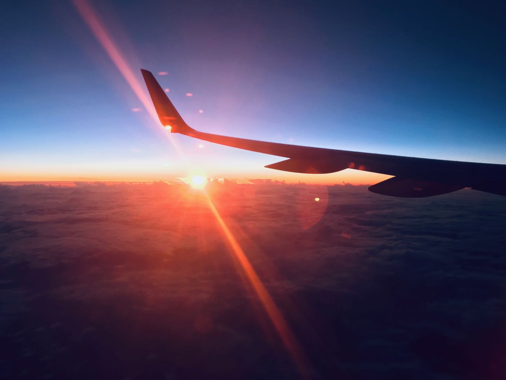
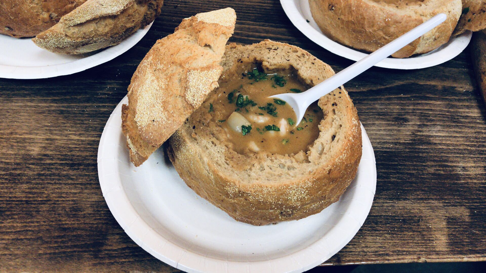

[`返回`](README.md)

> 标题：2018.12冰岛一周自驾环岛游记  
> 创建日期：2018-12-30   
> 修改日期：2018-12-30      
> 摘要：

# 引言
冰岛一直是我想去的国家，由于我在德国，趁着12月圣诞假和朋友们来一次自驾环岛，共两个男生两个女生。全程预计2500km，讲真之前还没开过这么长的距离，心里还是有点发虚的.而且本来预计是三个司机，然而另一个司机出了点状况来不了了，最后只剩两个司机。不过最后我们还是完美地跑了下来，还是很令人自豪的。冰岛真是个自然景观达到了极致的国家，在其他地方看不到这样的美景，真的令人陶醉。一周的旅行让我完全置身于烦恼之外，导致回来之后感到无比的空虚。。躺床上闭上眼睛，仿佛下一次睁开眼睛又会是在冰岛的小木屋中，即将开始下一段旅程。可惜睁开眼只有现实。趁着记忆还新鲜，赶紧记录下来，不然之后留给我的就只有那一段很不真实的记忆了。

# 行前准备
机票、住宿定好，大致的行程定好，驾照在国内公证好寄来德国，在Metzingen打折村入了北脸的防风裤和手套，以及Timberland的大黄靴子，毕竟是冰岛，还是要做好保暖措施的。（后面发现，冰岛其实并不冷，温度不低，只是经常风大。）其他的就没啥，等着被冰岛的自然景观震撼吧。

# Day1 12.21 抵达
早上从巴登巴登机场出发，经柏林转机，经历了一小时的晚点，最终于下午5点抵达冰岛。正好座位是靠窗的，从飞机上往下望去，冰岛已经是经验到我了，伴着夕阳，雪山和冻原交替着，加上对未来一周的冰岛之行的满心期待之情，那种感觉无法形容，总之就是个激动。

  
  
  

同行的两个妹子，燕和蓉，已经在一小时前抵达冰岛了，另一个司机，博，半夜12点才到。。于是我们先去机场附近的Sixt租车公司取了车，一辆Ssangyong Tivoli SUV，最便宜的四驱车。。取车的时候还发生了点小插曲，并不知道怎么发动汽车，开暖气和开后备箱哈哈。问他们，感觉我们像傻子一样。。并且一出停车场，在大雾的情况下没仔细看后边的车流情况，就直接进道了，结果碰到一辆警车，就被拦下来了，被教育了一番放走了。。真的能行吗这样！感觉很慌！

  
  

先去了宾馆把东西放下，立马品尝了下冰岛的自来水，简直美味！真的感觉非常清凉，非常舒服！真的是我喝过最好和的自来水，没有之一！然后晚上三个人一起去了雷克雅未克市区找点乐子。开过去将近一小时，算是适应适应。黑夜里的雷市真是漂亮！点点灯光灿烂无比。在市区逛了一圈，找了一家快餐吃了晚餐，一个大面包掏空，中间加入各种汤，重点是汤还能免费续！只需要2000克朗，性价比简直超值了！（因为是和后面几天的行程比起来，真的是便宜至极。。）海鲜汤真的是美味，店里放的各种甜品也随便吃，后面人越来越多，简直网红店。我后面续了一碗鳕鱼，也是相当不错的，还有羊肉汤，可惜我的胃不允许了。

  

饱餐一顿之后去了趟超市，买了之后的食物就回去了。话说这里的物价真的是逆天了啊，一小瓶矿泉水6欧，惊为天人。大半夜去机场接了博之后，回去唠唠嗑就洗洗睡了。酒店还有打乒乓球的地方，可惜玩不动了。（后面发现还有台球！）明天正式开始冰岛之旅！

# Day2 12.22 雷市+温泉
今日行程：在雷克雅未克市逛逛，转完之后晚上去蓝湖温泉泡温泉。  
一大早赶了个大早，出发去雷克雅未克市。（其实只是天没亮而已，然而冰岛11点左右天才亮。。）去了家网红早餐店Bakari Sandholt，打算品尝品尝冰岛的网红早餐。然而我们傻逼了，并没有点餐，而是点了店里的快餐，以为他们就是卖这些。。等我们在店里啃着面包的时候，看到边上人吃的却是热乎乎的早餐，感觉特别的蠢。。无奈最后点了两份甜品品尝了下，还是很美味的。

![早餐三明治]

![早餐甜品]

![玩弄可怜的甜品]

吃完早餐天刚蒙蒙亮，去海边走了走，日出惊艳到我了，真的是属于随手一拍就是壁纸系列。在海滩边无聊的几个人用石头搭了个小塔，留下我们的痕迹哈哈。冰岛的一切对我们来说都是新鲜的，甚至是一个对他们来说普普通通的垃圾桶，我们都围着拍照了好久。路过了市政厅和音乐厅，逛了下哈尔格林姆斯大教堂，路过了阴茎博物馆（太贵没进去哈哈，而且两个妹子好像比较尴尬），最后去了珍珠楼，算是把雷市都逛了一圈。晚上在市区的Ostabuoin Veitingahus吃了顿晚餐，海鲜汤和一盘叫不出名字的菜。没有太多印象，海鲜汤还是比较不错的，毕竟冰岛特产。

逛完了雷市之后，去了今晚的民宿，惊闻此处有斯诺克球桌，而且还是史蒂夫·戴维斯打过的地方！哇激动了激动了！不过还得去泡个温泉，回来再玩，和民宿老板约了下之后给我开放球桌。说说蓝湖温泉，一个人85欧，近几年涨价很厉害，貌似三四年前才40+，大概是为了控制人数吧。但进去之后人还真的不少。换好衣服冲了一下身子，然后就径直暴露在了0度以下的空气中，看到温泉就直接冲了进去什么也不管了，外面实在太冷了好吗。。进入温泉之后，那强烈的反差，简直要高潮了，太舒服了吧！温泉一股硫磺味，习惯了之后感觉就还好。火山泥敷脸之后，拿了杯果汁，和朋友们侃大山，其乐无穷。期间还有个小插曲，最后打算去储物柜拿手机拍照留念的时候，发现放手机的裤子不在柜子里，突然害怕，怕不是没放进去？结果还真是，在一旁的椅子上躺着呢。十分庆幸居然还在。。在国内早没了好吗。

回到了民宿，得马克一下这家民宿，博加斯旅馆，也是在机场附近。四个人住一间房。楼下有台球室，黑八随便玩，但是斯诺克需要和房主通告一下的，并不是所有人都能玩的，需要了解斯诺克的人才能碰。世锦赛级别的桌子，球杆，和球，这里曾经是众大佬聚集地，亨德利，马克威廉姆斯，希金斯等等（吐槽，没有火老师！），民宿的老板曾经是一家俱乐部的老板，12岁开始打球，所以和他们都很熟。在老板的注视下，我感觉打球异常有压力，而且好久没碰球杆了，真的是打都打不准了，还被老板教了一番如何瞄准。。不过这老板一看就是高手，可惜他要走了，没法陪我玩。练了一会之后就感觉手感上来了，真的是指哪打哪，太爽了吧！敢情我之前打不好不是我的错，是设备不够好哇！后来和老板娘攀谈了一会，她拿出了一本很旧的相簿，可惜里面的大佬我基本不认识，都是上个世纪的大佬了哇！这里的球台我都不舍得打，净是在拍各种艺术照了。。感觉已经值了，此趟冰岛之行。

# Day3 12.23 辛格韦德利国家公园+间歇泉+黄金瀑布+圣诞大餐
第二天将近12点抵达了辛格韦德利国家公园，天正好刚蒙蒙亮。这个国家公园还是非常大的，之前世界上最早的议会在此召开。毕竟作为黄金圈的一大顶梁柱，还是很有牌面的。走了一圈，围观了一个小瀑布，接着就发车前往间歇泉。

间歇泉地面上好多个小洞洞，不断往上冒着热气。两个姊妹泉眼相距不远，5分钟走路距离，妹妹给的面子够足，我们足足看看三回喷发，姐姐却是比较高冷，一回都没看到。看到那一个个的大洞，就想着往里钻，钻到最深处去瞧瞧是什么样。

离开了间歇泉之后差不多已经天快黑了，一天毕竟只有4小时的日照时间。。赶紧驱车前往黄金瀑布，希望能够在天完全黑之前参观到。最终成功看到这一壮观的自然风光，和之前在国家公园看到的小家碧玉的瀑布完全不是一个数量级的，留给我们的只有震撼。图还是照样放出来，但是完全表达不出来当时的感受，那种扑面而来的气息。

晚上在Selfoss找了家评分很高的餐馆，价格也是高的吓人，圣诞套餐一人12000克朗。。然而秉着“来都来了”的旅行哲学，一人点了一份圣诞套餐，就等着享受吧。最后这份大餐真的没让我们失望，感觉值得这个价。总共七道菜，每道菜都细细打磨，细细配合。如果把各种食材单独拎出来，其实并不见得有多好吃，但是经由他们一搭配，感觉就不一样了。说不出啥味道，因为之前从来没吃过这种食物。大部分是海鲜，而且七道菜分量十足。中间我们还暂停了一会，因为实在吃不下了，去超市买了点东西回来继续。。

吃完圣诞大餐已经是晚上十点多了，然而距离我们今晚住的民宿还有很长一段的距离。于是就开始我们的飙车之路了哈哈！今晚我驾车，后座俩妹子给我们放周杰伦的《漂移》，这谁能忍的住啊！速度噌噌噌就上来了，大晚上飙到150迈，也是没谁了。和另外三个路人互相飙车超车，巨爽，你超我我超你，达到了高度的默契，如此高的速度超车我感觉我的肾上腺素到了顶点了。最后我们四辆在进市区的时候全员超速。。也不知道有没拍照罚款。。

此时已经十一点多了，然而和民宿老板约的是11点入住。路遇一个景点，又一个瀑布，于是就拐了进去瞧了瞧。大晚上的已经没人来看瀑布了，借着景点的聚光灯，还是能感受到瀑布的壮观的。尤其是边上有个小道可以爬到半山腰，愈发近距离地感受瀑布。上去的时候迎面扑来的水汽，在这里是只属于我们四个人的壮美，可以说是另外一种震撼，一种超近距离的震撼。

抵达民宿之后，老板娘接待了我们，给了我们十分错误的信息。。说10 meter就能右转，然后就到了，结果我们真的10米就转，却是老板娘的房子哈哈。后来才知道，要到很前面再转，而且得很深入。这又1公里了吧啊喂！中间我们还找错了房子，一个破烂不堪的仓库和一栋有狗的房子。最后终于找到了我们的房子，却发现后车窗关不上了。一波未平一波又起啊！我们都已经做好了明天等待救援队的到来，然后明天行程泡汤的打算了。后来还是同行博，学汽车的大佬，想起了他之前学过的关于自动车门的知识，解决了问题。。不然真的只能呆在原地了。这番折腾到了两点多。民宿的房子还是很温馨的，很有感觉。两个房间一客厅，我选择睡客厅，特别有守夜人的感觉哈哈。

# Day4 12.24 飞机残骸+海蚀拱+维克黑沙滩+探讨人生+维京饮料
早上十一点多抵达飞机残骸附近，需要徒步3.6公里到达残骸。那就走呗，来都来了。这里其实也属于黑沙滩的范围，1973年一架美军飞机因燃料不足迫降冰岛南部，机组全部生还。因为回收成本过高，移走主要仪器之后残骸就一直留在了这。看到一大堆人爬到飞机顶部，其实是有点不爽的，仿佛听到了残骸的哭泣声。然而也不能做些什么。我是不愿意合照的，选好角度在没人的时候给残骸来了几张艺术照。过了残骸之后再往前走，就是海岸线了。

下一站，海蚀拱。经过了几段惊心动魄的陡峭山路之后，准备徒步前行。前方就更加的惊心动魄了。。这里大概有12级台风了吧？需要几个人互相扶持着才能前行。尤其是一个悬崖边上的电线杆边上，两个大男人在这里感受到了大自然的力量，巨大的风从下而上，阻挡着你继续前行。这里已经是风最大

# Day5 12.25 蓝冰洞徒步+钻石沙滩+霍芬自助餐+三个半小时山路

# Day6 12.26 各种瀑布+摔跤+独自追光

# Day7 12.27 阿克雷里

# Day8 12.28 西部区收尾+烤鸡

# Day9 12.29 返程

[`返回`](README.md)  