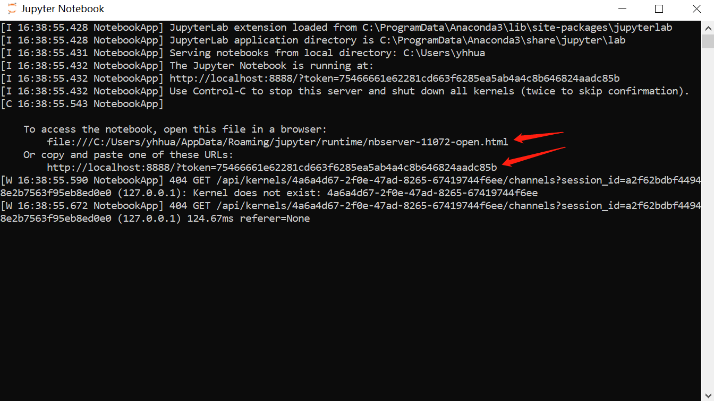

[`返回`](README.md)

> 标题：Jupyter在Windows中的安装与使用教程  
> 创建日期：2019-01-08   
> 修改日期：2019-01-08  
> 摘要：

应女友之邀来写写有关如何在Windows下安装和使用Jupyter。（其实很简单哈哈！）

# 安装
1. 安装Anaconda。打开https://www.anaconda.com/download/，选择Windows环境

2. 请下载对应合适版本python的64位程序

3. 下载完请双击安装！

# 使用
1. 安装完打开Jupyter Notebook

2. 打开之后是个黑黑的框框，见下图

3. 等一会！之后会提示你是否用浏览器打开，选择是。没提示则忽略，自动打开。并且黑框框变成下图所示（按照里面提示，打开此服务器之后也可以手动输入网址来打开Jupyter Notebook）

4. 此时浏览器成功打开Jupyter Notebook

5. 选择uplode，导入本地.ipynb文件，导入之后单击打开即可。

# 注意事项
1. 导入文件后，文件路径不能修改，否则要重新导入。所以推荐在GitHub的本地仓库里进行导入，文件修改之后可以直接用GitHub上拉至云端。

# 其他未来可能更新的内容
1. 如何更加快捷使用Jupyter Notebook，不用每次都导入
2. 如何将Jupyter Notebook和GitHub自动联动

----------
> 参考资料：  
> https://jupyter.org/install

[`返回`](README.md)  