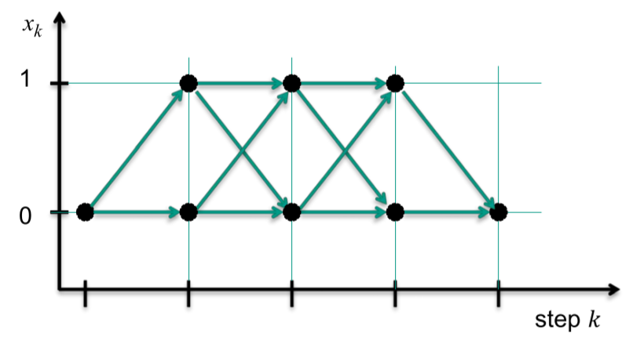
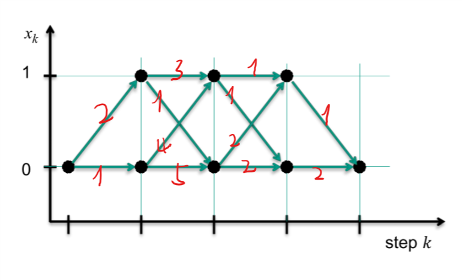
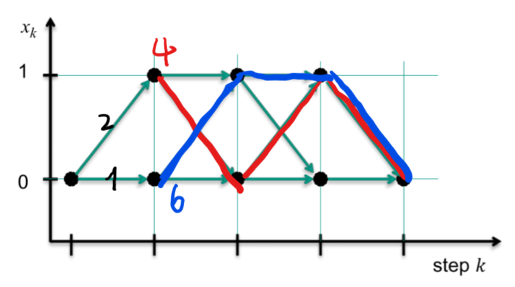
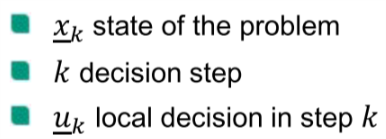
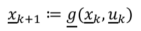
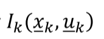
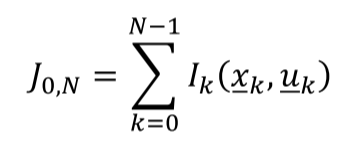
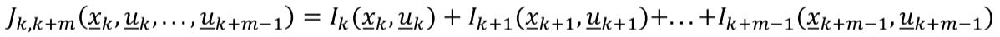
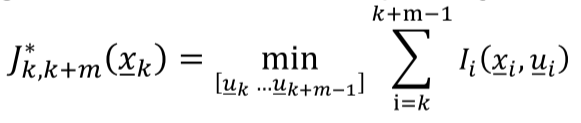
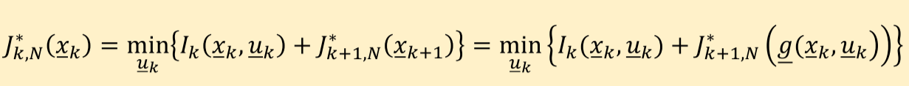

[`返回`](README.md)

> 标题：Bellman方程概述及其应用与扩展  
> 创建日期：2019-01-11   
> 修改日期：2019-01-17  
> 摘要：从动态优化理论中的Bellman算法出发，聊一聊此算法和控制理论之间的联系。

# 1. Bellman算法介绍
Bellman算法是动态优化理论中用来求解最优路径的一种算法，下面以一个小例子来入手介绍这个算法。

## 1.1 一个小例子
见下图，假设我们从最左边的点开始出发，最终想要到达最后边的点，并且每次都只能向右边或者右上或者右下行进，也就是只能一路向右。那么那条路是我们的最优解呢？

很显然，是直接向右走。因为很明显，直接一路向右能够走的距离最短。那么现在加入一个概念，cost，也就是说，在每段路径上加上一个损耗值，比如某段路在修路，那么它的损耗值就大，某段路路况很好，那么它的损耗值就小。假设在直接向右的路上有修路段，那么很显然这条路不一定是我们的最优解了。我们在加入cost之后的路径见下图。

那么现在再来看我们的问题，哪条路是cost总和最小的路线？第一种想法，很直观，我们直接把所有可能路线的cost值都算出来，看哪个最小就是我们要走的路。这是最容易想到的一种想法，在这张图中，我们总共有2x2x2=8条可能的路线，大有可能把所有路线都列出来，然后比较。那么如果每步的可能性增大了呢？又或者总共的步数增多了呢？比如总共有10步，每步有10种可能性，那么最后我们所有可能的结果是10^10种，难以想象。所以现在就需要想想如何减少我们计算的数量，尽可能快地知道我们走哪条路最快。于是乎，Bellman算法就出来了。  

## 1.2 Bellman算法在上述例子中的使用
现在我们来看看Bellman算法是如何在这个例子中实现的。假设现在我们站在终点处，回头看，我们会看到两条路径，一条上一条下，往上走cost为1，往下走cost为2，可能你会觉得，这时候应该往上走。但是别忘了，有可能往上走之后会碰到修路的，反而得不偿失。所以我们就先这样放着，一条线向上，一条线向下。  

接下来第二步，站在我们刚刚看的那两个点，(4,1)和(4,0)，再往回看。比如我们站在上面那个点，回头看又会发现两条路，一条上一条下，往上走cost为1，往下走cost为2。然后同样的，我们站在点(4,0)往回看，也能看到两条路，最后我们可以得出，我们到达点(3,1)和(3,0)总共各有两种方式。比如我们要去点(3,1)，一条上一条下，总的cost分别为2和3，那么这时候我们就可以说，想要到达(3,1)我们只能走上面那条路。同样的，我们到达点(3,0)只能走上面的路，因为总的cost小。同理，我们再往回看，依样画葫芦，完成了第三步，我们确定了两条到达点(1,1)和(1,0)的最优路径，如下图所示。

最后一步，很容易看出，一条是4+2，一条是6+1，很显然最终我们选择红色那条，这也就达到了我们的目的。我们再仔细看看这个算法，当我们在第三步的时候，我们所需要计算的数量其实只是和第二步之后到达的点以及从这两个点出发有多少个路径，因为每个点有2条可能性，所以2x2=4，我们在每步需要计算4次。还是刚刚那个假设，10步，每步有10种可能性，那么按照Bellman算法，我们在每步只需要计算100次，最终是10个100相加，也就是1000次计算就可以得出结果，相比于之前的10^10，Bellman算法把计算量降低了不知多少个数量级。

## 1.3 Bellman算法的数学表达式
Bellman算法最核心的思想就是，**优化路径的每个部分都是最优的。**好好体会这句话。用《Optimal Control Theory》里的表述就是，“Each **tail** of the optimal path has to be optimal.”我们现在引入几个概念：  

用上面的例子来看，k就是我们在第几步，xk表示现在所处的状态，比如我们从左往右，第二步完成之后可能处于(3,1)，也可能处于(3,0)，所以这两个点就是这一步的状态。而uk就表示第k步有那些可能性，比如例子中的向上或向下。所以我们计算下一步的时候有：

也就是说下一步的状态只和当前状态以及此状态下可能的路径有关。接下来我们引入cost的真面目，用Ik来表示第k步的cost：

当我们从一开始到最终的cost总和用J来表示：

这里表示的是从第0到第N步，也就是从头到尾。如果只是其中一部分呢？我们定义**“costs to go”**：

而优化过后的“optimal costs to go”可以表示成（加个星号）：

整个算法是**递归**型的，也就是层层往下算的。我们从N状态开始，一步一步往下，到k状态的时候，我们的J函数表示为：

这里可以看到，此时的J是和k+1状态到N状态的J有关的，而k+1的J又和上一步有关，层层递进。于是我们可以总结Bellman算法的具体步骤。

## 1.4 Bellman算法的递归思想

----------
> 参考资料：  
> Donald E. Krik: Optimal Control Theory, (2004), p.53

[`返回`](README.md)  