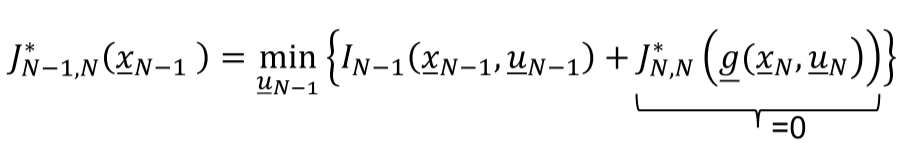
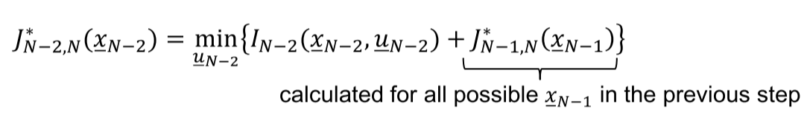
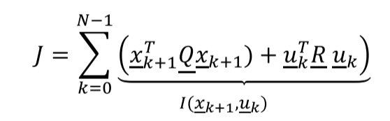
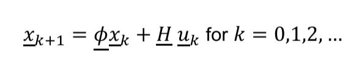
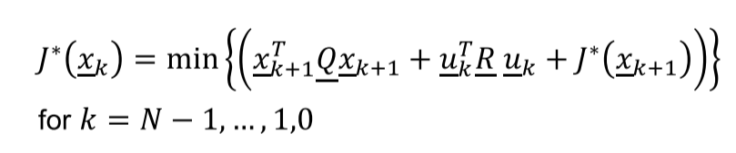
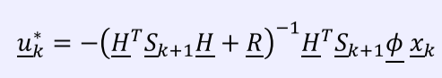
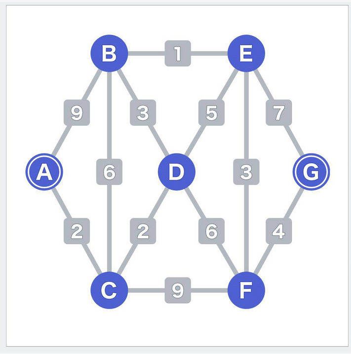

[`返回`](README.md)

> 标题：Bellman方程概述及其应用与扩展  
> 创建日期：2019-01-11   
> 修改日期：2019-01-17  
> 摘要：从动态优化理论中的Bellman方程出发，聊一聊此算法的一些应用，包括线性二次(LP)问题，路径优化问题，引出Bellman-Ford算法，以及其在Q-Learning算法中的应用。

# 1. Bellman方程介绍
Bellman方程是动态优化理论中用来求解最优路径的一种算法，下面以一个小例子来入手介绍这个算法。

## 1.1 一个小例子
见下图，假设我们从最左边的点开始出发，最终想要到达最后边的点，并且每次都只能向右边或者右上或者右下行进，也就是只能一路向右。那么那条路是我们的最优解呢？

很显然，是直接向右走。因为很明显，直接一路向右能够走的距离最短。那么现在加入一个概念，cost，也就是说，在每段路径上加上一个损耗值，比如某段路在修路，那么它的损耗值就大，某段路路况很好，那么它的损耗值就小。假设在直接向右的路上有修路段，那么很显然这条路不一定是我们的最优解了。我们在加入cost之后的路径见下图。

那么现在再来看我们的问题，哪条路是cost总和最小的路线？第一种想法，很直观，我们直接把所有可能路线的cost值都算出来，看哪个最小就是我们要走的路。这是最容易想到的一种想法，在这张图中，我们总共有2x2x2=8条可能的路线，大有可能把所有路线都列出来，然后比较。那么如果每步的可能性增大了呢？又或者总共的步数增多了呢？比如总共有10步，每步有10种可能性，那么最后我们所有可能的结果是10^10种，难以想象。所以现在就需要想想如何减少我们计算的数量，尽可能快地知道我们走哪条路最快。于是乎，Bellman方程就出来了。  

## 1.2 Bellman方程在上述例子中的使用
现在我们来看看Bellman方程是如何在这个例子中实现的。假设现在我们站在终点处，回头看，我们会看到两条路径，一条上一条下，往上走cost为1，往下走cost为2，可能你会觉得，这时候应该往上走。但是别忘了，有可能往上走之后会碰到修路的，反而得不偿失。所以我们就先这样放着，一条线向上，一条线向下。  

接下来第二步，站在我们刚刚看的那两个点，(4,1)和(4,0)，再往回看。比如我们站在上面那个点，回头看又会发现两条路，一条上一条下，往上走cost为1，往下走cost为2。然后同样的，我们站在点(4,0)往回看，也能看到两条路，最后我们可以得出，我们到达点(3,1)和(3,0)总共各有两种方式。比如我们要去点(3,1)，一条上一条下，总的cost分别为2和3，那么这时候我们就可以说，想要到达(3,1)我们只能走上面那条路。同样的，我们到达点(3,0)只能走上面的路，因为总的cost小。同理，我们再往回看，依样画葫芦，完成了第三步，我们确定了两条到达点(1,1)和(1,0)的最优路径，如下图所示。

最后一步，很容易看出，一条是4+2，一条是6+1，很显然最终我们选择红色那条，这也就达到了我们的目的。我们再仔细看看这个算法，当我们在第三步的时候，我们所需要计算的数量其实只是和第二步之后到达的点以及从这两个点出发有多少个路径，因为每个点有2条可能性，所以2x2=4，我们在每步需要计算4次。还是刚刚那个假设，10步，每步有10种可能性，那么按照Bellman方程，我们在每步只需要计算100次，最终是10个100相加，也就是1000次计算就可以得出结果，相比于之前的10^10，Bellman方程把计算量降低了不知多少个数量级。

## 1.3 Bellman方程的数学表达式
Bellman方程最核心的思想就是，**优化路径的每个部分都是最优的。**好好体会这句话。用《Optimal Control Theory》里的表述就是，“Each **tail** of the optimal path has to be optimal.”我们现在引入几个概念：  

用上面的例子来看，k就是我们在第几步，xk表示现在所处的状态，比如我们从左往右，第二步完成之后可能处于(3,1)，也可能处于(3,0)，所以这两个点就是这一步的状态。而uk就表示第k步有那些可能性，比如例子中的向上或向下。所以我们计算下一步的时候有：

也就是说下一步的状态只和当前状态以及此状态下可能的路径有关。接下来我们引入cost的真面目，用Ik来表示第k步的cost：

当我们从一开始到最终的cost总和用J来表示：

这里表示的是从第0到第N步，也就是从头到尾。如果只是其中一部分呢？我们定义**“costs to go”**：

而优化过后的“optimal costs to go”可以表示成（加个星号）：

整个算法是**递归**型的，也就是层层往下算的。我们从N状态开始，一步一步往下，到k状态的时候，我们的J函数表示为：

这里可以看到，此时的J是和k+1状态到N状态的J有关的，而k+1的J又和上一步有关，层层递进。于是我们可以总结Bellman方程的具体步骤。

## 1.4 Bellman方程的递归思想
那么我们现在来看一下Bellman方程具体的步骤有哪些。

1. 从终点N的上一步N-1开始，我们的最优cost to go可以表示成：  
  
此时我们后一步的开销是0，所以也就是说，这一次算出来的开销其实就是最后一步的开销，再往后没有了。

2. 由于这里我们的方程有一个min的操作，也就是说，我们需要得到最后一步最少的开销是多少。如果我们的操作u是离散的，那可以通过枚举找到最小值。如果我们的u是连续的话，那么我们就需要利用到参数优化里面的各种方法来找到最小值，比如最速下降法，比如牛顿法等等，有机会我再（挖坑）写一篇文章关于参数优化的各种方式以及如何选择。

3. 开始进行到上一步，也就是N-2步，我们继续计算我们的开销函数J。这回的方程是：  
  
这回我们的总的开销是我们这一步所需要的开销加上这一步行进之后的总开销，也就是迭代我们第1步中所算出来的值，这样我们就可以得到我们N-2步的开销值。同样的，如果我们的操作是连续的，那么我们依然需要用到参数优化中的方法来求出最小值。  
4. 重复之前的步骤，直到达到我们的第0步，也就是起点处，就可以判断出哪条路径的开销最小，也就找到了我们的最优路径。

# 2. Bellman方程的应用
上述是Bellman方程的大致思路，也就是通过迭代来计算出下一步所产生的cost，最终选择cost最小的u的序列。那么我们现在就来看看Bellman方程的一些应用举例。首先是LP(Linear-Quadratic)问题。

## 2.1 LP (Linear-Quadratic)问题
首先我们给出目标函数J的LP表述方式：  
  
这里的R是正定矩阵，Q是半正定矩阵。我们的x可以不影响我们最终的目标函数，但是我们的u需要能够影响我们的J，不然的话就没有意义了。然后我们的状态x满足的关系式：  
  
也就是说，下一个状态既和当前状态有关，又和我们所要进行的action有关。现在我们将我们的目标函数套入Bellman方程中：  
  
经过一系列繁琐的数学计算之后，我们得到最优的控制序列u：  
  
可以看到，最终得出来的结果也是线性的。这也就是Bellman方程在线性问题中的应用。

## 2.2 Bellman方程的扩展——路径优化问题
我们再回头看看1.1中的例子，是不是会产生这样的疑惑：如果是实际中的最优路径问题，可不是这样有状态的呀！所以其实实际上，上面说的Bellman方程其实都并不是实际中的最优路径优化问题，一般是用于一些实际中的最优操作选择的问题，你会有各种的状态值。但是对于真正的路径优化问题，我们需要对这个Bellman方程进行再优化，让它能够适用于路径优化的问题。于是乎，我们的**Bellman-Ford算法**就出现了！  
Bellman-Ford算法就是应用于真正的路径优化问题中。先看看Wiki上对于Bellman-Ford算法的简述吧：
> “The Bellman–Ford algorithm is an algorithm that computes shortest paths from a single source vertex to all of the other vertices in a weighted digraph.”  

  
这个算法要扯起来又是一个大坑了。。这里就作一个简要的概述。其实这个算法是Bellman和Ford同时提出来的，所以最后这个算法就用他们两个人的名字来命名了。不过其实思想还是“算钱”，哪条路最便宜选哪条路。  
这个算法的核心思想可以说还是递归。我们假设从起点开始我们的算法，先**初始化起点的cost为0，其他所有点都是无穷大**，然后从起点开始一步一步往后，对每个点的价值函数进行更新（每条路径双向更新），并剔除掉“贵”的路径。一轮更新完毕之后，根据我们之前了解到的，其实你的价值函数是跟下一步的价值函数有关，也就是说是跟后面所有的cost有关，那么此时有些点其实是较晚更新的，但是你之前的点的计算就用到了这些还没更新的点，所以**我们需要进行第二轮的更新**。如此往复，直到所有点的价值函数不变了，那么可以说我们的算法完成了，也就选出了最终cost最小的路径。  
另外说一点，这个算法的每条路径其实不一定都是正值，也可以是负值，负值也是能计算的。并且有些路径只能是单向行进或者是双向的cost不一样的的，那么就只考虑单向的价值更新或者是双向的价值更新分别考虑。还有一种特殊情况，那就是**负环**的存在，如果有负环存在，那么价值函数会一直在里面兜圈子出不来，比如存在一段路径的cost负值够小，那么就会产生这样一个问题。但这对于Bellman-Ford算法来说都不是问题。如果转圈圈的次数超过N次，那么就能判断出这张图里存在负环，也就终止算法了。所以Bellman-Ford算法也可以用来一张图中的负环检测。

## 2.3 Q-Learning
Q-Learning其实是Bellman-Ford算法的应用，但是毕竟都用到了Bellman方程的递归思想，所以也就在这里提一下。后面应该会有一篇专门介绍Q-Learning算法，到时候还会再提一提Bellman方程在Q-Learning算法中的变动（比如说加入了衰减系数等）。  
那么首先一个问题，Q-Learning算法是什么呢？做什么用呢？Q-Learning是强化学习中的一个算法，也是计算最优路径的。比方说，这里有一个迷宫，你把机器丢到迷宫当中，让他自己找到走出迷宫的最快的路线，这是Q-Learning的典型应用。  
它的基本思想是：设立一个Q值，对于每个状态x，每个操作s，都有一个Q值，Q值表达的是对于一个状态x，下一步进行操作s的潜在回报是多少。这样所有的Q值可以写成一个矩阵形式。一开始，这个机器是什么都不知道的，它完全不知道这个迷宫长什么样。所以他要学习不是？**所以一开始的Q矩阵是个零矩阵。**接下来对于这个迷宫可以建立一个R矩阵，也就是**Reward回报函数**，表征的是每个状态x对于每个操作u能够产生怎么样的回报，这个回报是**即时的奖励**，但还并不是最终的Q值，因为根据Bellman的思想，最终的Q值还应当包含**潜在的奖励值**。所以现在对每个点，每个操作进行第一轮的学习，更新了一轮Q矩阵。但这还没完，按照2.2 Bellman-Ford算法的思想，还需要不断的进行更新，**直到这个Q矩阵不再更新了**，那么算法结束。现在也就是机器学习完了这个迷宫。如果把他随机丢到一个地方，它按照Q矩阵来，选择最终回报价值最高的路线走，那么就是最快能够到达终点的路线。

----------
> 参考资料：  
> Donald E. Krik: Optimal Control Theory, (2004), p.53  
> https://en.wikipedia.org/wiki/Bellman%E2%80%93Ford_algorithm  
> 《Optimization of Dynamic Systems》 of KIT  
> APP 《算法动画图解》  
> Bilibili 《【人工智能】决胜AI--深度学习框架-Tensorflow案例实战》

[`返回`](README.md)  