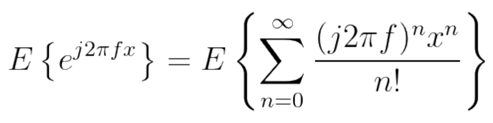

[`返回`](README.md)

> 标题：如何理解随机变量的特征函数  
> 创建日期：2019-01-18   
> 修改日期：2019-01-23  
> 摘要：随机变量的特征函数的通俗解释

# 1 引言
通常我们都是用概率密度函数或者概率分布函数来描述一个随机变量，毕竟十分的直观，这个变量有多少概率是多少值一目了然。但是其实这有个问题，那就是在对于一些统计值的研究上面概率密度或者概率分布就比较不直接了。所以如果我们从另一个角度去描述一个随机变量，或许可以看到更多的可能性。

# 2 泰勒级数
了解特征函数就一定得先温习温习泰勒级数。  
泰勒级数，简单来说，就是用一连串的变量的n次方相加来近似这个原函数。泰勒级数长这个样子：  
  
也就是说，如果两个函数的泰勒级数都长得一样，那么这两个函数就是一样的。而泰勒级数的每一项就是这个函数的一个“特征”。根据这个思路，那么我们可以把我们的概率密度函数进行一个改造，从泰勒级数的视角来审视它。

# 3 随机变量的特征
我们先来看看随机变量的特征。一个随机变量拥有众多统计学特征，比如均值，比如方差，比如偏态等等，但这些特征都是和各阶矩有关，比如均值是一阶矩，方差和一阶二阶矩有关，偏态和三阶矩有关等等。所以说我们可以只看随机变量的各阶矩，看看能不能折腾出什么东西。

# 4 特征函数
我们定义特征函数：  
  
为什么定义呢？我们将这个式子中e部分进行泰勒展开，得到：  
  
也就是：  
  
注意到了没，这里泰勒展开之后就得到了一系列n阶矩的和，而这些n阶矩就是变量的特征，故我们称这个定义的式子为特征函数，因为它表征的是这个随机变量的一系列特征。

# 5 特征函数的应用
既然我们可以对特征函数进行特勒展开而得到一系列的n阶矩，那么具体能做什么用呢？这里提两个最重要的作用：计算n阶矩，以及随机变量的相加。  
1. **计算n阶矩**  
我们对这个特征方程求n阶导可以得到：  
  
于是乎，我们可以得到随机变量x的n阶导是：  
  
也就是说，我们需要几阶矩就对特征方程求几阶导，然后令f=0也就是后面的项都忽略掉，那么就是我们泰勒展开中的第几个矩了。  
2. **随机变量的相加**  
假设我们现在有一个新的随机变量，是n个这样的随机变量相加而成的，也就是：  
  
如果我们求其概率密度函数，那么就是一系列概率密度函数的卷积，非常之麻烦。但是如果我们求其特征函数，可以看到根据exp函数的性质，最后我们会得到一系列特征函数的累积：  
  
从卷积转为累积，也是我们的常见应用之一。

----------
> 参考资料：  
> http://www.360doc.com/content/18/0706/11/15930282_768244807.shtml

[`返回`](README.md)  