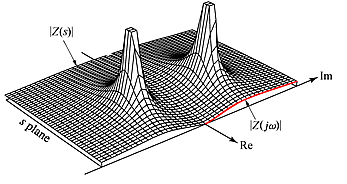
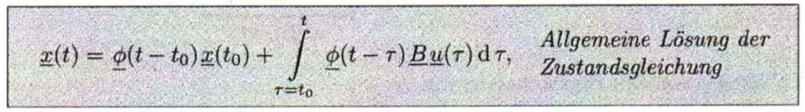
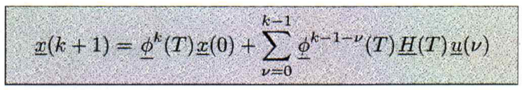
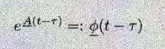
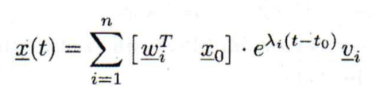
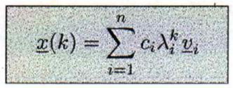

[`返回`](README.md)

> 标题：控制系统传递函数的极点和零点  
> 创建日期：2019-01-26   
> 修改日期：2019-01-26  
> 摘要：简要谈谈我对极点和零点的看法，以及根据零点判断稳定性的实际意义。

学了这么久控制系统，却到今天才想起来要研究研究极点和零点的物理意义，真是惭愧惭愧。。。今天抽点时间来想想看，极点和零点到底是个什么东西。

# 1 极点和零点
从网上看到一张图，特别形象，贴出来：  
  
在复平面上，这张类似地形图一样的东西就可以表示极点和零点。这张图每个点的高度为输出的幅度，每个点表示的输入频率。极点就是使输出爆炸的频率，而零点就是使输出为0的频率。这样一来对于连续系统的稳定性就好解释了：如果极点在虚轴右侧，则这个系统在极点处就会爆炸，不稳定。但是如果极点都在左侧，系统的频率又不能达到负值，于是乎在能够达到的正频率下是没有爆炸点的，所以系统稳定。但是很可惜，**对于离散系统的稳定性似乎不能这么解释**，下面尝试以状态方程通解的角度来阐释离散系统稳定性的条件。

# 2 连续和离散系统稳定性条件的差异
## 2.1 从状态方程的通解说起
先给出连续系统和离散系统状态方程的通解公式：  
  
（连续系统状态方程通解）  
  
（离散系统状态方程通解）  
对于这两个公式怎么得来的，如果我有时间有兴趣再写写。。对于这两个公式来说，都由两个部分组成：初始状态部分，以及输入函数u随时间产生的效果累加部分（也就是相当于输入函数u和矩阵B的卷积，表征输入函数u在时间上的效果叠加）。这两个公式的关键都在于第一部分中的过渡矩阵Φ。过渡矩阵Φ的定义是：  
  

## 2.2 稳定性条件
这里采用Lyapunov稳定条件，也就是在状态空间对系统稳定性的一个探究，而非传统传递函数稳定条件。

### 2.2.1 连续系统
首先来看看连续系统。对矩阵A进行对角化处理，可以得到状态方程的解的第一部分可以写成：  
  
其中累加是对于所有的特征值来累加的。对于系统稳定，我们有：当t趋近于正无穷时，这个式子应当趋近于0。什么意思呢？就是说当很久很久之后，我们的状态量应当是收敛的，而不是发散的。**对于系统稳定，我们探究的是输入为0的情况**，也就是不存在通解第二部分的情况。如果没有输入了，最后状态还不能收敛，那这个系统还有什么用？？所以看看这个式子，x(t)最后趋近于0，也就是说对于所有的特征值来说，中间的exp部分需要是收敛的，也就是所有的特征值需要小于0。这也就得出了我们的连续系统的稳定性条件：**所有特征值位于左半平面**。  

### 2.2.2 离散系统
接着来看离散系统。同样的，忽略掉通解的第二部分，对A进行对角化，得到x(k)的通解：  
  
同样的，对于k趋近于正无穷，需要x(k)趋近于0，所以说中间的λ部分需要趋近于0，也就是所有的特征值的模小于1。这也就得到了离散系统的稳定性条件：**所有特征值位于单位圆内**。

----------
> 参考资料：  
> http://www.sohu.com/a/280213031_465219  
> RLM Skript at KIT

[`返回`](README.md)  