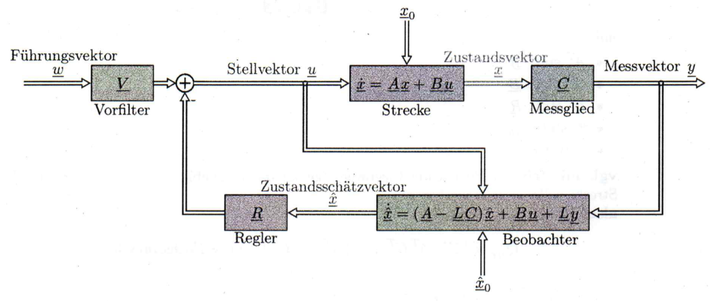
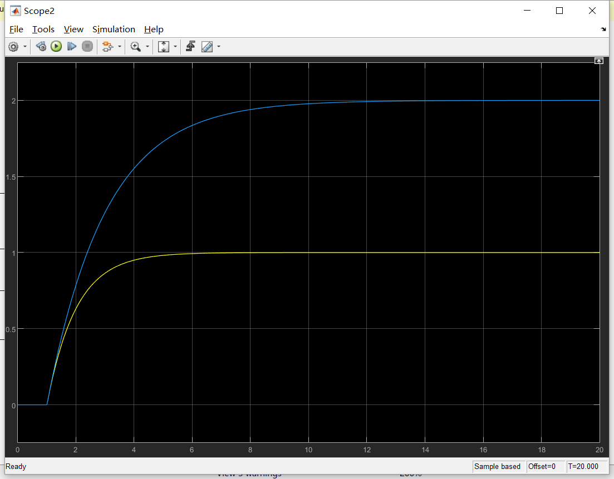
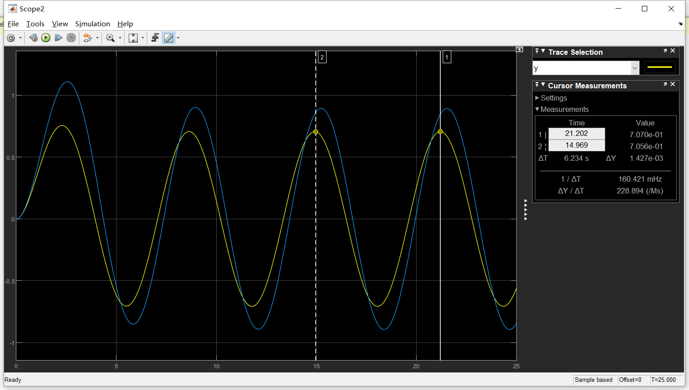

[`返回`](README.md)

> 标题：基于Simulink的SISO系统观测器探究  
> 创建日期：2019-01-27   
> 修改日期：2019-01-27  
> 摘要：探究n=2的SISO系统观测器在不同输入条件下，以及在开闭环中的不同响应。

# 1 探究条件
## 1.1 观测器框图
  
（开环观测器框图）  
  
（闭环观测器框图）  

## 1.2 状态方程转换及Simulink参数设定
从上面框图可以看到，观测器的状态方程和三个变量x, u, y有关，于是我们需要转化为一般状态方程形式，将y整合到输入u里。见下图：  
  

我们设定以下参数作为原始系统参数：  
	A=[-1 0;0 -2]
	B=[1;1]
	C=[1 1]
	D=0
观测器参数L在之后对极点进行调整之后可以算出。  
Simulink参数设定：  
  

# 2 开环观测器探究
## 2.1 Simulink框图建立
  
其中输入信号先探究单位阶跃信号。

## 2.2 单位阶跃输入信号
这里分四种情况，第一种是观测器特征值和原始特征值相同，第二种情况是在原始左侧，第三种是在右侧，第四种是一个在左侧一个在右侧。由于特征值在虚轴右侧的情况观测器不稳定，这里不考虑。  

### 2.2.1 特征值相同
L=[0;0]  
参数设定：  
  
输出结果：  
  
观测器和原始系统一致。

### 2.2.2 特征值位于左侧
这里首先**取特征值为-2和-3，L=[2;0]**。
参数设定：  
  
输出结果：  
  
由于未加入反馈，原系统不受影响。观测器幅值增大至1.5。  
接着**取特征值为-4和-4，L=[9;-4]**。
输出结果：  
  
观测器幅值增大至2.5。

### 2.2.3 特征值位于右侧
这里**取特征值为-1/2和-1，L=[0;-3/2]**。  
输出结果：  
  
观测器幅值增大至2，并且有明显的延迟。

### 2.2.4 特征值一个位于左侧，一个位于右侧
这里取特征值为-1/2和-3，L=[-1;3/2]。  
输出结果：  
  
观测器幅值最终为0。。。神奇。。。

## 2.3 单位正弦输入信号
特征值相同的情况观测器与原始系统一致，之后不再讨论。  

### 2.3.1 特征值位于左侧
参数设定与2.2一致，下同。  
首先是-2，-3特征值。  
输出结果：  
  
稳定之后，观测器幅值为1，但是原始系统幅值为0.75左右。观测器幅值仍大于原始系统。并且观测器有稍许延迟，见下图：  
  

接着是-4，-4特征值。  
输出结果：  
  
结果显示，原始系统幅值不发生变化，仍为0.75左右。观测器幅值增大，并且稍有延迟。  

### 2.3.2 特征值位于右侧
输出结果：  
  
幅值差距比上一节小，但是相位位移明显。

### 2.3.3 特征值一左一右
输出结果：  
  
观测器反而提前。。。神奇。。。  

## 2.4 随机信号输入（均值1，方差1，采样时间0.05）
### 2.4.1 特征值位于左侧
首先是-2，-3特征值。  
输出结果：  
  
观测器幅值大于原始，但是趋势捕捉良好。  

接着是-4，-4特征值。
输出结果：  
  
幅值差距过大，且趋势捕捉稍差。

### 2.4.2 特征值位于右侧
输出结果：  
  
居然看起来还不错？？

### 2.4.3 特征值一左一右
输出结果：  
  
幅值趋近0，不能用。  

## 2.4 随机信号输入（均值0，方差1，采样时间0.01）
### 2.4.1 特征值位于左侧
输出结果：  
  

### 2.4.2 特征值位于右侧
输出结果：  
  

### 2.4.3 特征值一左一右
输出结果：  
  

# 3 带反馈观测器
## 3.1 Simulink框图建立
首先是不带观测器的反馈框图：  
  
此时M和R已经调节至输出信号和输入信号相同。同样，加入观测器之后的框图：  
  

## 3.2 单位阶跃输入信号
### 3.2.1 特征值位于左侧
-2，-3：  
  

-4，-4：  
  

### 3.2.2 特征值位于右侧
  

### 3.2.3 特征值一左一右
  

## 3.3 正弦信号输入
### 3.3.1 特征值位于左侧
  
  

### 3.3.2 特征值位于右侧
  

### 3.3.3 特征值一左一右
  

##3.4 随机信号输入（均值1）
### 3.4.1 特征值位于左侧
  
  

### 3.4.2 特征值位于右侧
  

### 3.4.3 特征值一左一右
  

----------
> 参考资料：  
> [百度知道-已知状态空间模型的矩阵ABCD和观测器增益矩阵K，那么用simulink仿真检验跟踪效果时，如何仿真？](https://zhidao.baidu.com/question/1947016050623336708.html)  
> [Simulink快速入门-创建简单模型](https://ww2.mathworks.cn/help/simulink/gs/create-a-simple-model.html?s_cid=learn_doc)  
> [CSDN博客-Simulink学习笔记（一）——构建Simulink框图](https://blog.csdn.net/weixin_41695564/article/details/80742321)  
> [百度知道-怎样在matlab function模块中实现多输入](https://zhidao.baidu.com/question/1366600520973670379.html)  
> RLM Skript at KIT

[`返回`](README.md)  