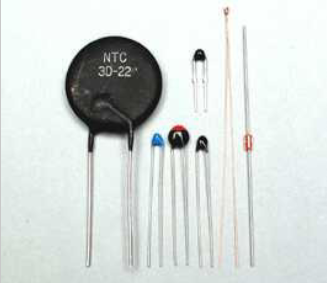
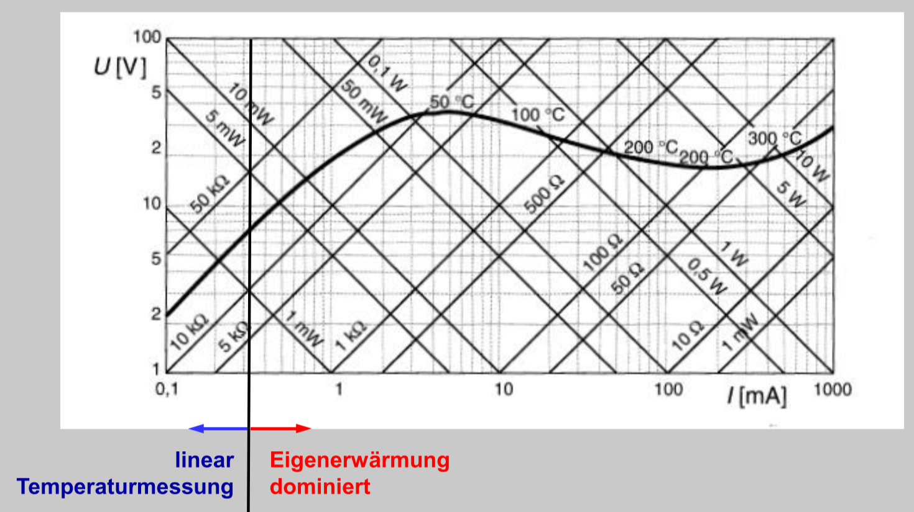
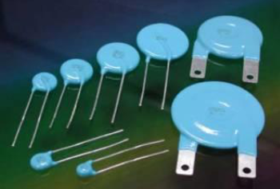
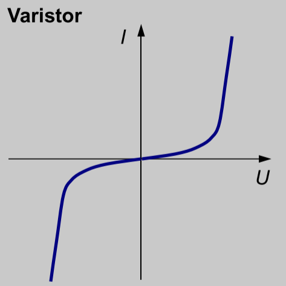
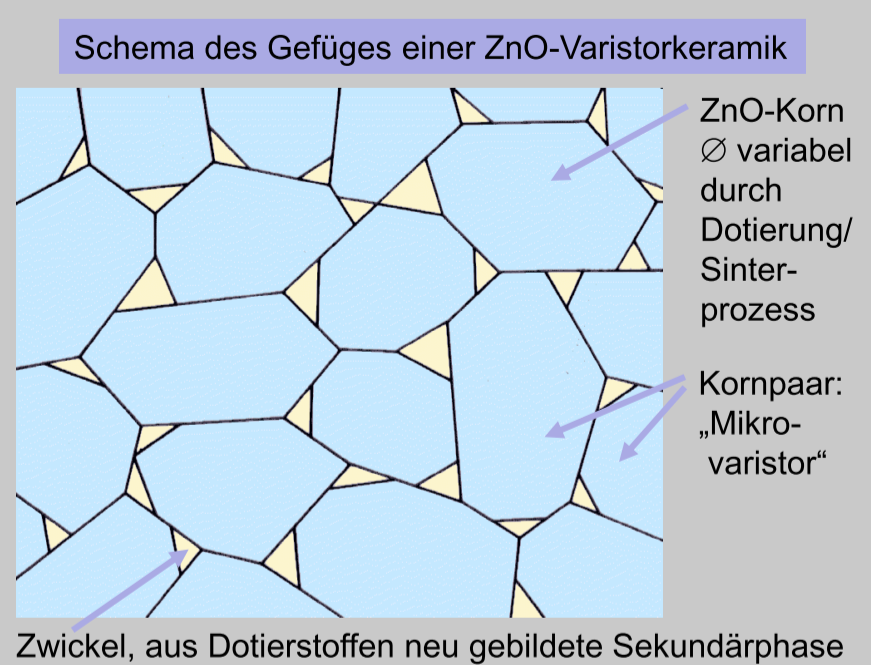
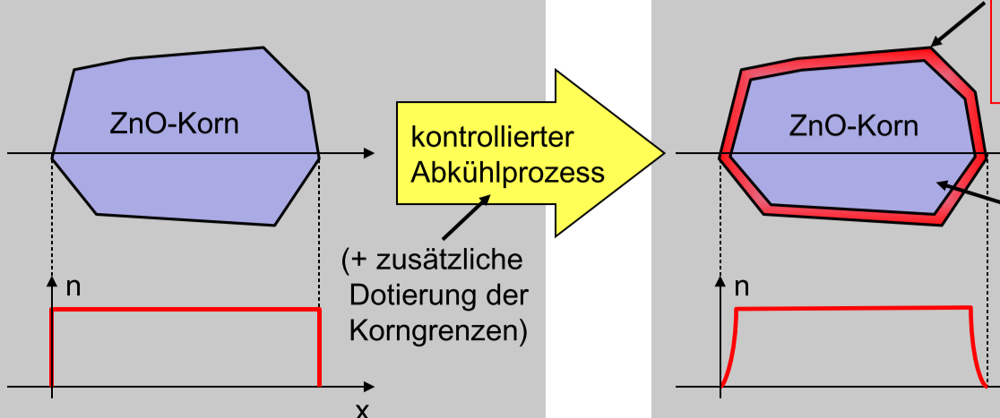
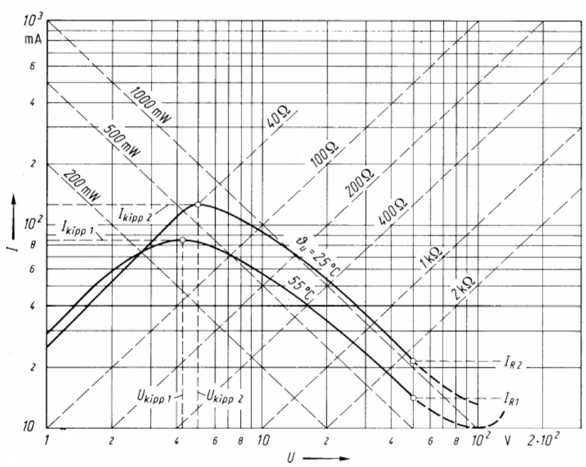
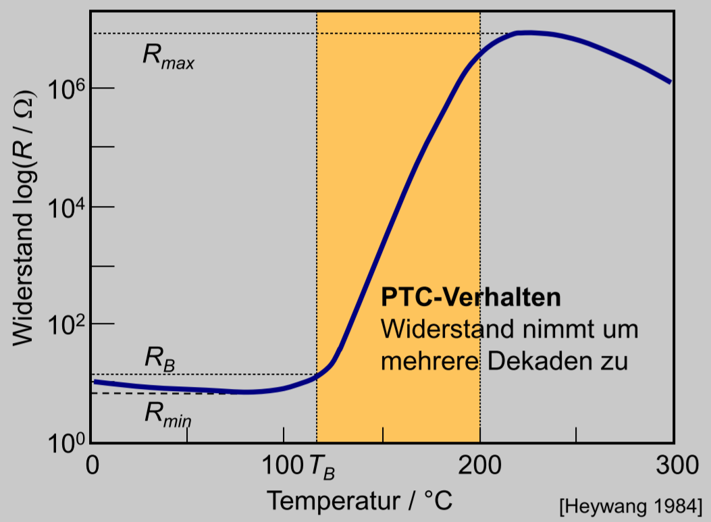
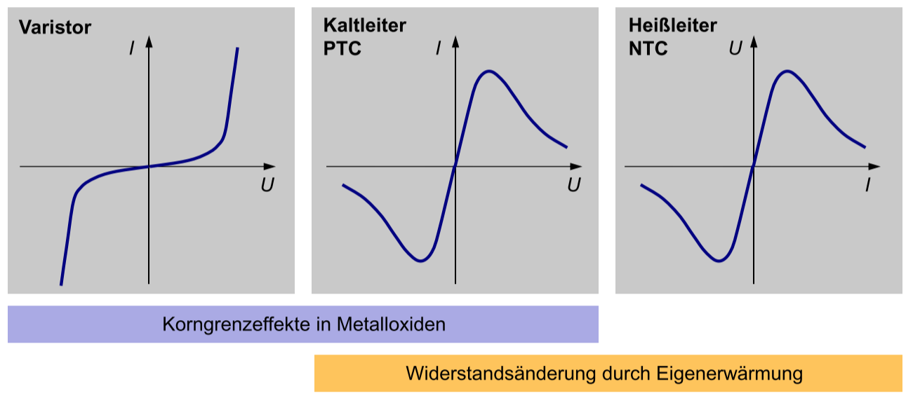

[`返回`](README.md)

> 标题：NTC, PTC与varistor  
> 创建日期：2019-01-31   
> 修改日期：2019-01-31  
> 摘要：三种材料的对比和物理基础。

# 1 NTC
  

Negative Temperature Coefficient，负温度系数，顾名思义，电阻率随温度的升高而下降，也被称为Heißleiter（高温导体）。常见应用比如说温度传感器，或者是稳压原件。IU图如下：  
  
左侧是先行测温区，右侧是自热区，也就是功率增大之后受到自身发热作用，导致电阻下降，而左侧测温区电阻恒定，可以接入电路中进行测温作业，根据外部热对流与电路内部功率相等，可以通过此时的电流/电压测出当前温度。  

作为稳压原件时，和电阻一起接入，如果电路电路增大，一般电阻电压线性增大，但是NTC在后半段电压反而下降，最后总电压可以基本维持不变。  

**物理基础——电子跳跃传导(elektronische Hoppingleiter)**。在温度高的时候电子跃迁至导带没问题，但是在低温度的时候也表现出一定的导电性，这时候的电子还没跃迁至导带，而是需要进行Hoppingleitung。此时电子不需要跃迁至导带，而是只要克服EA能量就可以到下一个能量低谷，所以这也会导致多价元素的价交换(Valenzaustausch)，比如Fe。  

# 2 Varistor
为什么要先说这个？其实是有原因的，因为PTC的物理基础较复杂，并且其中也包含了varistor的物理基础，所以先说说varistor以便于后面对于PTC的理解。  
  

Varistor, variable resistor，也就是可变电阻的意思。其IU图如下：  
  
可以看到，随着电压的上升，电流上升的越来越快。这里先说一下，**可变电阻不受温度的影响。**常见应用比如说过电压保护装置。  

**物理基础——晶格边界效应(Korngrenzeffekte)**。如下图所示，材料由众多蓝色的晶格构成，黄色部分为掺杂的第二项。  
  
每个晶格与晶格之间形成的边界可以充当微小的电阻和电容的并联。那么当电压小的时候，电荷主要集中在电容表面，并没有形成电流。而当电压继续增大之后，电容表面电荷满载，此时电流逐渐形成。这也就解释了varistor的IU图特性了。  

而为什么会形成这样的晶格边界效应呢？其实是通过烧结而后降温得到的。如下图所示：  
  
左边是烧结温度为1300度的时候，载流子浓度仍然很均衡。但是当经过一定的降温过程之后，形成右图，边界部分的载流子浓度几乎为0（需要利用缺陷化学来解释），导致了边界处形成了断路。  

# 3 PTC
终于来到了PTC。PTC和NTC相对，是正温度系数电阻，也就是说电阻随温度升高而上升，所以又称为Kaltleiter（低温导体）。其UI图如下（注意是UI图而不是IU图）：  
  
电阻随温度的变化图如下：  
  
这里可以看到，其实PTC的电阻并不是都是一直上升的，而是其中有一段是PTC区域，而两边其实还只是NTC区域。常见应用有比如说温度传感器，开关延迟，作为发热器等等。  

**物理基础——晶格边界效应+铁电效应**。注意了，这里的PTC虽然受晶格边界效应的影响，但是其实特性是不太一样的，因为材料的缘故。用作PTC的材料比如说BaTiO3，其在边界处虽然载流子数目依然很低，但是由于在边界处存在大量的Ba离子空穴，导致吸引大量的电子前来围观，其实电阻也不是很大的。这也就是为什么在IU图中一开始的特性和varistor的后半段很接近，都是电流随着电压不断上升。但是随着电路功率的不断上升，材料收到自身发热的影响，开始展现出PTC效应，也就是在一定温度之后电阻不断上升，导致电流的下降。那么这里的电阻上升，其实是由于**铁电效应**。这里的一定温度其实是居里温度，也就是材料磁性转变的温度。低温情况下材料呈铁磁性，而超过居里温度之后材料呈顺磁性，减少了很多的内部电场，因此电阻下降。

# 4 总结与对比
  
这张图很好地总结了这三种材料。varistor和PTC是受到晶格边界效应的影响，同时PTC和NTC是受到温度的影响。但是这里要说明一下PTC和NTC测温原理的不同。虽然两者都是作为温度传感器的原件，但是原理还是不太一样的。NTC测温主要利用的是线性测温区，也就是电阻不变的区域，接入到电路中，电流和电压会随着环境温度而进行线性增长。而PTC是利用的PTC区域，也就是电阻随温度线性上升区域。此时如果给个定压或定流电源，那么随着电阻的改变，也可以测得此时的温度。最主要的不同就是，NTC测温时电阻是不变的，而PTC测温时电阻是上升的。

----------
> 参考资料：  
> PB(Passive Bauelemente) at KIT

[`返回`](README.md)  