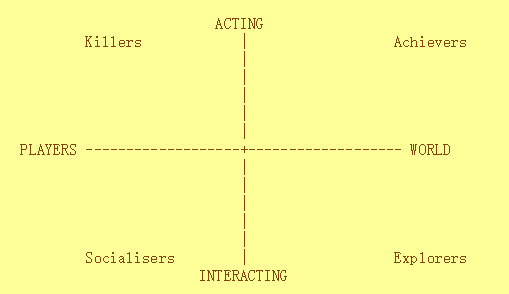
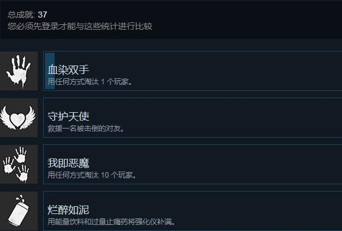
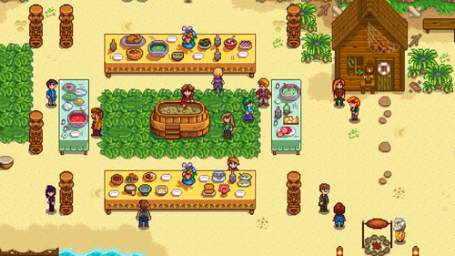
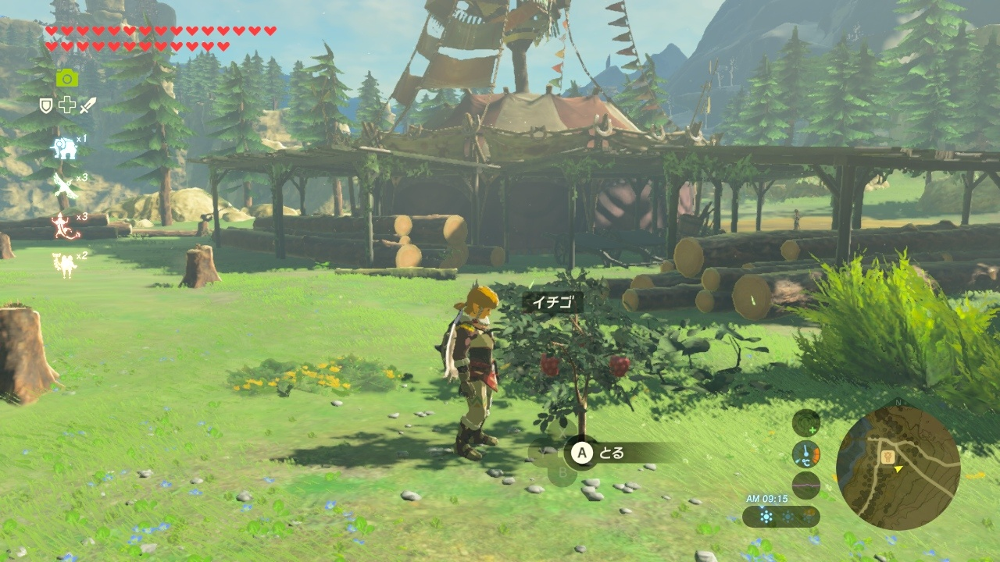
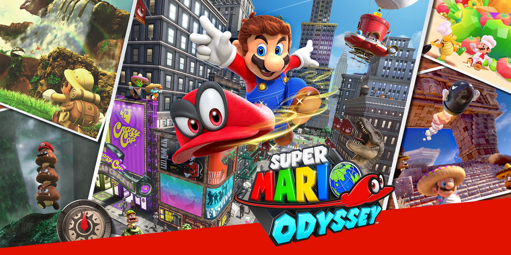
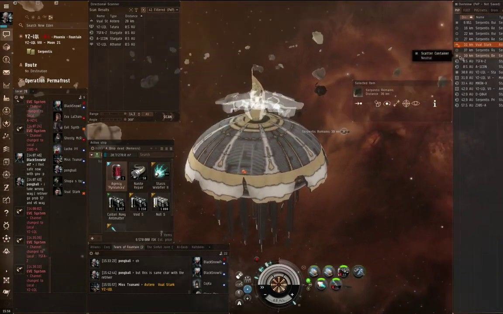
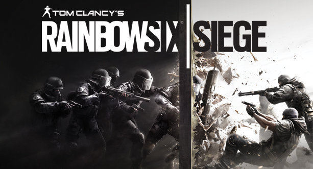
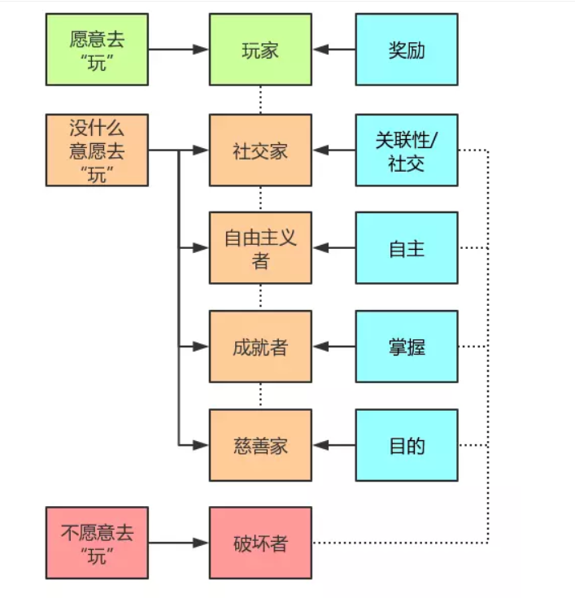
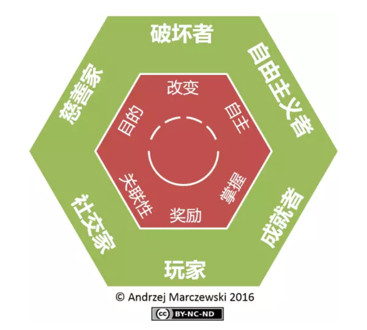
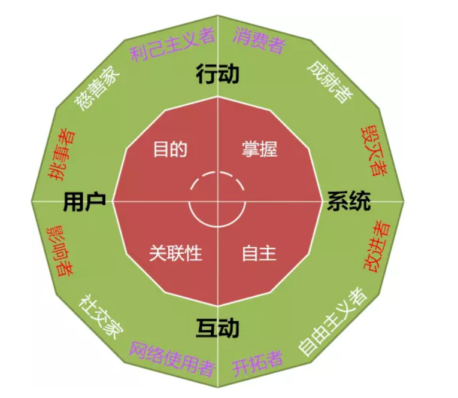

[`返回`](README.md)

> 标题：巴特尔玩家分类模型  
> 创建日期：2019-03-28  
> 修改日期：2019-03-28  
> 摘要：简述巴特尔玩家分类模型，包含四个维度将玩家群大致分为四个类别。

**巴特尔玩家分类模型**，是由Richard Bartle在1996年在一篇名为《HEARTS, CLUBS, DIAMONDS, SPADES: PLAYERS WHO SUIT MUDS》的论文中提出的一个重要玩家分类模型，将玩家群按照扑克牌的花色分为四种类别，可以说是现在几乎现在所有其他玩家分类模型的基础。虽然该拓扑结构比较简单，但是几乎可以涵盖所有的玩家类型，是个相当重要的理论基础。该模型在被提出的时候虽然被应用于**MUD**游戏类型（Multiple User Domain，早期的文字网络游戏），但是该模型依然可以被应用于其他的游戏类型。  

按照Richard Bartle的观点，可以参照下图作出一个分类表，其中横轴表示玩家交互对象的重心，左侧为偏向玩家(Players)，右侧为偏向游戏世界(World)；纵轴表示玩家的交互行为的重心，上侧为偏向操作(Acting)，下侧为偏向社交(Interacting)。**由此将玩家群分为四个基本类型——成就型(Achievers)，探索型(Explorers)，社交型(Socialisers)和杀手型(Killers)。**下面开始一一介绍这几种类型。  
  

# 第一类：成就型玩家 (Achievers)  
成就型玩家注重于对于游戏世界的操作，也就是渴望在游戏中得到成就感。对于游戏中给定的种种目标和奖杯等，希望可以得到全成就以此来获得成就感。哪怕获得成就的过程枯燥无味，也乐此不疲地刷成就。对于这类玩家，也许游戏的过程并不是最重要的是，重要的是能够达成所有的成就。而且即使游戏中没有设计相关的成就，玩家也会自己给自己设定目标，然后来获得成就感。这类玩家最重要的一个特征就是，一款游戏没打成全成就就不爽。因此现在的游戏基本都设定有“成就”这个项目，以此来满足此类玩家的需求。比如PC上Steam平台的成就，或者是各大主机平台的成就，都是基于此的设计思想。各个游戏内也设有各类成就，比如GTA中对各类物品的收集达成的全成就，或者是育碧公司的几乎所有游戏，也都有收集成就要素。  
  

# 第二类：探索型玩家 (Explorers)  
探索型玩家注重于对于游戏世界的社交，也就是希望能够探索完整个游戏的世界，每个角落都不放过，对于游戏中的每个NPC的对话、每个角落可能存在的隐藏物品等等，他们渴望的是对于游戏的探索，是这个探索的过程让他们获得乐趣。他们与成就型玩家也许都有某种程度上的“收集癖”，但是最大的区别就是，探索型玩家是从收集的过程中获得乐趣，而成就型玩家是通过收集全要素之后的成就感来获得乐趣。所以说对于探索型玩家来说，游戏的丰富性就是一个重要的指标，游戏能否不断地提供新鲜感，或者是文本信息是否足够多，让他们能够更好地了解这个世界。因此现在游戏也都在往丰富的方向发展。  

举个例子，还是GTA，毕竟是我心目中的神作。侠盗猎车手-罪恶都市，一款02年的游戏，但是其游戏性之丰富，让我在现在19年依然可以玩的很开心，因为我本质上也是一个探索型玩家。所以GTA在游戏丰富度上是做的相当出色的。另一个代表就是任天堂的游戏，以丰富的游戏性著称，比如塞尔达传说，比如马里奥奥德赛，都是能够让你在大量游戏时间之后仍然能够有足够的新鲜感，来支撑你继续游戏。独立游戏也有做的很出色的，这里提一款我最喜欢的，星露谷物语，也是属于探索型玩家特别热衷的一款游戏。  
  
  
  

# 第三类：社交型玩家 (Socialisers)  
这类玩家著重于对于玩家的社交，这类玩家很明显，就是渴望在游戏中社交，通过社交来获得乐趣。对于网络游戏，游戏内容本身可能不是重点，重要的是可以和别人交流，有时候甚至可以什么都不做，就到工会里聊上一整天。据说EVE中的蹲站就是这样的一种玩法，大型科幻背景题材下的聊天室。。。如果是单机游戏，这类玩家也希望能够在现实中找到同样喜欢这款游戏的玩家进行交流，找到志同道合的朋友，组建群，逛论坛等等，他们主要是从社交中获得乐趣。  
  

# 第四类：杀手型玩家 (Killers)  
杀手型玩家注重于对于玩家的操作，通俗的讲，就是通过击败其他玩家来获得乐趣。这类玩家可以说是最多的，这也就是为什么现在在线竞技游戏越来越多。他们上分、爬天梯，都是为了能够和高手过招，享受击败厉害的对手的乐趣。但是这类玩家容易畸变，比如变成喷子，通过嘲讽对手来获得假象的击败对手的乐趣。甚至是开挂，他们本质都是杀手型玩家，只不过是心理畸变造成的后果。现在的网络游戏基本都有排位这个功能，也就是为了服务于这类的玩家群。  
  

# 基于巴特尔玩家分类模型的游戏设计思想  
基于此，如果我们要把一款游戏的用户量尽可能最大化，那就要尽可能考虑到上述所有四种玩家。比如前一段最火的绝地求生，可以说是最具有代表性的一款游戏，巨大的输赢家比例满足成就型玩家，众多的武器配件和足够大的地图满足探索型玩家，组队语音满足了社交型玩家，同时PVP击败对手又可以让杀手型玩家获得满足感。且不说这款游戏如何，但是这种**大逃杀模式的集大成的性质**，现在几乎被各大游戏所借鉴，以此来扩大游戏的玩家群。  

# 拓展  
这里要说明一点的是，每个玩家都不是固定的属于某种类型，或多或少都是多种类型的混合体。比如我自己，最主要的是探索型的类型，因此适合我的是丰富的游戏性，但同时我又包含了小部分的成就型和杀手型，但都很不明显。社交型是完全没有。。。因为我完全不喜欢在游戏中进行社交。  

另外，此分类模型并不是包含了所有的玩家，还有更加复杂的分类模型，比如基于巴特尔模型的Marczewski分类模型，把玩家分为六种类型，见下图:  
  
  
对于这六种类型的用户，如果再根据不同的目的进行细分，还可以得到Dodecad分类模型，详见下图：  
  
但是由于巴特尔模型的简单和适用于大部分玩家群体的性质，因此巴特尔模型也被广泛地使用。  

----------
> 参考资料：  
> [1] [Richard Bartle: HEARTS, CLUBS, DIAMONDS, SPADES: PLAYERS WHO SUIT MUDS, (1996)](https://mud.co.uk/richard/hcds.htm)  
> [2] [Bilibili-【游戏众生相】从此拒绝撕X！玩家的四种类型！](https://www.bilibili.com/video/av47404667/)  
> [3] [游戏化设计的玩家类型框架](https://www.jianshu.com/p/10a3f47852ed)  
> [4] [百度百科-MUD游戏](https://baike.baidu.com/item/MUD%E6%B8%B8%E6%88%8F/8378850)  

[`返回`](README.md)  